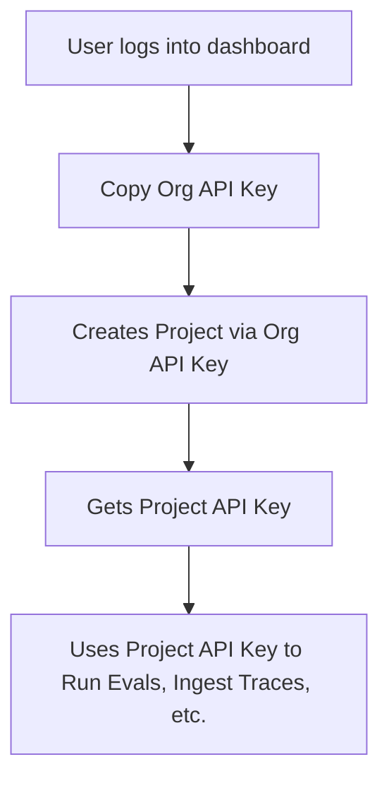
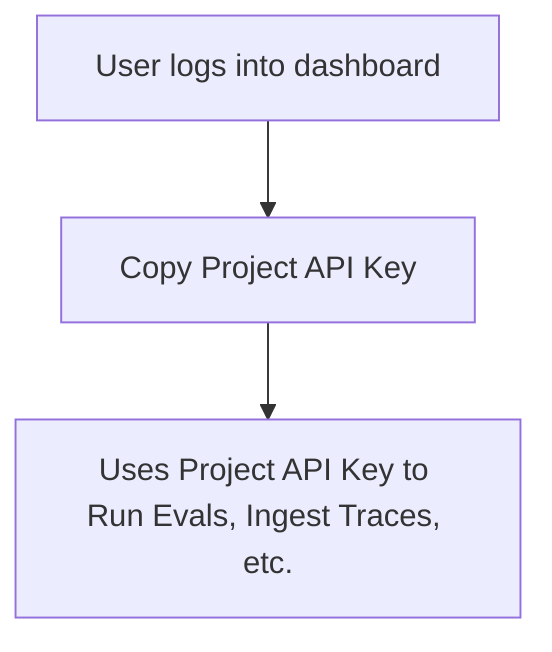

import { Cards, Callout } from "nextra/components";

# Confident AI RESTFUL Evals API

Confident AI enables organizations to offload evaluations, tracing, dataset management, and prompt versioning via a comprehensive **RESTFUL Evals API**.

Whether you're evaluating LLM outputs in production or integrating directly with [DeepEval](https://github.com/confident-ai/deepeval), the platform supports a multi-tenant structure for clean project-level isolation and scalability.

How is this different from DeepEval?

The Evals API provides more low-level control over the DeepEval client and provide benefits that DeepEval alone doesn't offer:

**Managed Infrastructure**: Serverless evaluations on our managed servers, error handling for metric failures and retries, cost management and billing optimization, automatic scaling based on evaluation volume. 

**Platform Dashboard**: Visual results for each customer dataset, historical tracking and trends, team collaboration features, custom analytics dashboards.

<Callout>
DeepEval also calls the Evals API under the hood, and all metrics ran through the Evals API is powered by DeepEval!
</Callout>

How is the Evals API different from using the platform?

The Evals API and platform serve different use cases in your LLM application development workflow:

**Platform (Dashboard)**: Use when your engineering teams need to improve an LLM application. It provides visual test case creation, interactive evaluation results, team collaboration features, and built-in dashboards.

**Evals API**: Use when building an LLM application that needs to automate evaluations for different customers, run evaluations programmatically, build custom dashboards, integrate into existing workflows, or scale across multiple customer environments.

Both approaches use the same underlying evaluation engine, so you can start with the platform for development and use the API for production automation.

When you use DeepEval in Python or Typescript, you are actually calling some of the endpoints in the Evals API. For example, a test run is created at `/v1/test-run`, while ingesting traces happens at `/v1/traces`, which is called by DeepEval under-the-hood.

<Callout type="warning">
The Evals API gives you more low-level control than using DeepEval, but at the same time means you lose the typesafety features offered by DeepEval.
</Callout>

## Who's This For?

The Evals API is designed for:

1. Organizations that need to **scale evaluations across multiple customers or environments** while maintaining visibility into results.

Click here for example use case

Consider **EduTechAI**, a startup building AI-powered tutoring systems for universities. They serve 50+ universities, each with their own unique requirements:

- **Harvard University** needs AI tutors for computer science courses
- **Stanford Medical School** wants AI assistants for medical school applications  
- **MIT Sloan** requires AI coaches for business case studies

**The Challenge**: Each university needs evaluation results for their specific use cases, but EduTechAI doesn't want to manage evaluation infrastructure for 50+ different environments.

**The Solution**: EduTechAI uses the Evals API to:

1. **Offload evaluations**: Send test cases from each university's AI tutors to Confident AI for evaluation, with data segregated for each **organization**
2. **Customer-specific results**: Each university gets evaluation results tailored to their use case, separated by organization
3. **Dashboard visibility**: The engineering team can log into the platform to see evaluation results for each university, track performance trends, and identify areas for improvement. At any point, university stakeholders can also log in to view their specific results
4. **Scalable infrastructure**: No need to maintain evaluation servers for each customer

This pattern applies to any organization serving multiple customers with different LLM use cases - from SaaS platforms to consulting firms to enterprise software providers.

2. Users that aren't working with Python or Typescript. If users are working with either Python or Typescript, using DeepEval as your client library is highly recommended.

## Authentication Flow

Th Evals API offers a more flexible control over projects and organizations via code. Confident AI supports two types of API keys:

- **Project API key:** This is the only API key you'll need **IF** platform usage is all you want. It lets you send evaluations, traces, and manage datasets and prompts via DeepEval/Evals API.
- **Organization API key:** This is the API key you'll need for project provisioning via the **Evals API**. It allows you manage projects, as well as specific Project API keys for subsequent CRUD actions.

When you use the Evals API, this will be your authentication flow (**NOTE:** logging into dashboard only required for initial setup):

Note that if you're purely using the platform, this will be your authentication flow instead:

<Callout>
Although a bit redundant, you can also create projects manually on the platform before saving each Project's API key manually to be used in the **Evals API**.
</Callout>
