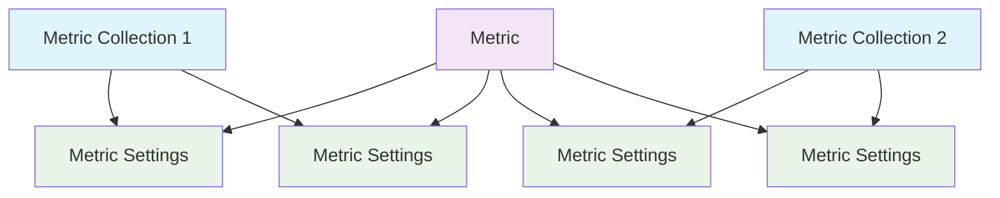

import { Callout } from "nextra/components";

# Data Models for Metrics

A **metric** is responsible for computing evaluation scores, and a **metric collection** represents a group of related **metrics** that you want to evaluate together. Metric collections and metrics are connected in-directly via **metric settings**, which specifies the specific threshold, strictness, etc. of each metric in different collections.

• **Metric**: A DeepEval metric - all of DeepEval's metrics are available through the Evals API.

• **Metric Settings**: Configuration options for how a metric within a metric collection should be evaluated, including the **thresold**, **strictness**, and whether to **include reasoning**.

• **Metric Collection**: A group of metrics that you wish to evaluate together (either for a test run or online evaluation).



<Callout>
Confident AI's Evals API takes care of all of the complicated relationships under the hood.
</Callout>

The reason why a metric collection does not relate directly to metrics is because a metric requires settings in order for it to run - which should not be duplicated across different collections. The good news is as a user you don't have to care about the underlying logic except for the name of the metric you wish to include for your collection.

## Metric

A metric is uniquely identified within a project via its `name` and `multiturn` value. For example, you can have two metrics with the same name only if they are not both single/multi-turn. You also cannot use any of the default names that are already reserved by Confident AI.

```typescript filename="metric.d.ts"
type Metric = {
    name: string;
    criteria?: string;
    evaluationSteps?: string;
    requiredParameters?: LLMTestCaseParams
    multiturn?: boolean; // defaults to false
}
```

As you'll learn in the next section, although the `criteria` and `evaluationSteps` fields are option in reality you will be required to provide either field when creating a metric. This is because all metrics you create are by definition custom metrics (powered by [G-Eval](https://deepeval.com/docs/metrics-llm-evals)), and therefore will always require a `criteria`/`evaluationSteps`.

## Metric Settings

A metric setting defines the configurations of how a metric should be ran during evaluation:

```typescript filename="metric-setting.d.ts"
type MetricSetting = {
    metric: Metric;
    activated?: boolean; // defaults to true
    threshold?: number; // defaults to 0.5
    includeReason?: boolean; // defaults to true
    strictMode?: boolean; // defaults to false
}
```

<Callout type="info">
The `activated` field allows you to avoid running metrics that are already in your collection.
</Callout>

## Metric Collection

A metric collection groups related metric (along with their settings) together for evaluation:

```typescript filename="metric-collection.d.ts"
type MetricCollection = {
    name: string;
    metricSettings: MetricSetting[];
    multiturn?: boolean; // defaults to false
}
```

Note that you can only add metric settings whose metrics has the same `multiturn` value as the metric collection you're creating.