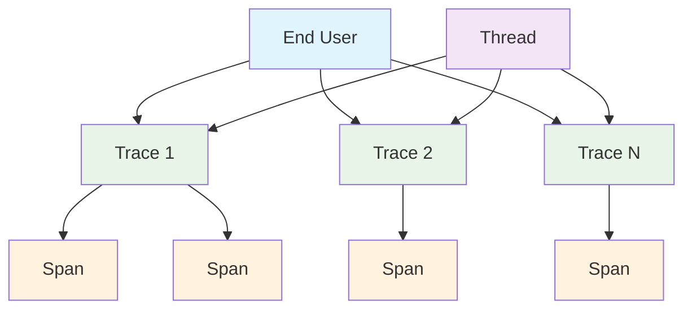

import { Callout } from "nextra/components";

# Data Models for Traces

A trace represents the overall process of tracking and visualizing the execution flow of your LLM application. Each observed function creates a span, and many spans together make up a trace.

• **Trace**: Complete execution flow containing multiple spans representing an LLM request's full lifecycle.

• **Span**: Individual units of work (LLM calls, tool executions, retrievals) that compose a trace.

• **Thread**: Logical grouping of traces sharing execution context for organizing related operations, this will 99.9% be a conversation.

• **End User**: Human user interacting with the trace, which is usually also the consumer of the LLM application.



## Trace

A trace contains multiple spans, and at the same time can belong to an end user and/or thread:

```typescript filename="trace.d.ts"
type Trace = {
    uuid: string;
    input?: any;
    output?: any;
    startTime: string; // ISO datetime
    endTime: string; // ISO datetime
    environment?: 'production' | 'development' | 'staging' | 'testing';
    metadata?: Record<string, any>;
    tags?: string[];

    // Span collections
    baseSpans: BaseSpan[];
    llmSpans: LlmSpan[];
    retrieverSpans: RetrieverSpan[];
    toolSpans: ToolSpan[];
    agentSpans: AgentSpan[];

    // Relationships
    threadId?: string;
    userId?: string;

    // Evals
    metricCollection?: string;
    traceTestCase?: {
      input: string,
      actualOutput: string,
      expectedOutput?: string,
      context?: string[],
      retrievalContext?: string[],
      toolsCalled?: ToolCallData[],
      expectedTools?: ToolCallData[],
    };
}
```

You can run [online evals](/docs/llm-tracing/online-evaluations) by providing **BOTH** the name of the `metricCollection` you've created on Confident AI and `traceTestCase`.

## Span

All `baseSpans` types in a `Trace` are defaulted to [custom spans](/docs/llm-tracing/tracing-features/span-types#custom-span), with the loosest type strictness:

```typescript filename="span.d.ts"
type BaseSpan = {
    uuid: string;
    name: string;
    input?: string | Record<string, any> | any[];
    output?: string | Record<string, any> | any[];
    error?: string;
    status: 'COMPLETED' | 'ERRORED';
    startTime: string; // ISO datetime
    endTime: string; // ISO datetime
    traceUuid: string;
    parentUuid?: string;
    metadata?: Record<string, any>;

    // Evals
    metricCollection?: string;
    spanTestCase?: {
      input: string,
      actualOutput: string,
      expectedOutput?: string,
      context?: string[],
      retrievalContext?: string[],
      toolsCalled?: ToolCallData[],
      expectedTools?: ToolCallData[],
    };
}
```

You can run [online evals](/docs/llm-tracing/online-evaluations) by providing **BOTH** the name of the `metricCollection` you've created on Confident AI and `spanTestCase`.

<Callout type="warning">
Note that `parentUuid` **MUST NOT BE** provided for root spans in a `Trace`.
</Callout>

### LLM span 

If you provide spans through the `llmSpans` of a `Trace`, your span will be created as an [LLM span type](/docs/llm-tracing/tracing-features/span-types#llm-span), and will need an additional `model` argument:

```typescript filename="llm-span.d.ts"
type LlmSpan = BaseSpan & {
  model: string;
  costPerInputToken?: number;
  costPerOutputToken?: number;
  inputTokenCount?: number;
  outputTokenCount?: number;
}
```

The model argument allows you to automate the process of cost and latency tracking, which you can [learn more about here.](/docs/llm-tracing/latency-and-cost-tracking)

### Retriever span

If you provide spans through the `retrieverSpans` of a `Trace`, your span will be created as an [retriever span type](/docs/llm-tracing/tracing-features/span-types#retriever-span), and will need an additional `embedder` argument:

```typescript filename="retriever-span.d.ts"
type RetrieverSpan = BaseSpan & {
  embedder: string;
  topK?: number;
  chunkSize?: number;
}
```

### Tool span

If you provide spans through the `toolSpans` of a `Trace`, your span will be created as an [tool span type](/docs/llm-tracing/tracing-features/span-types#tool-span):

```typescript filename="tool-span.d.ts"
type ToolSpan = BaseSpan & {
  description?: string;
}
```

A tool span does not require additional mandatory arguments because it automatically takes the `input` and `output` of the `BaseSpan` as tool input parameters and outputs.

### Agent span

If you provide spans through the `agentSpans` of a `Trace`, your span will be created as an [agent span type](/docs/llm-tracing/tracing-features/span-types#agent-span):

```typescript filename="agent-span.d.ts"
type AgentSpan = BaseSpan & {
  availableTools: string[];
  agentHandoffs: string[];
}
```

A agent span is similar to the tool span where the it automatically takes the `input` and `output` of the `BaseSpan` as I/O if not set explicitly.