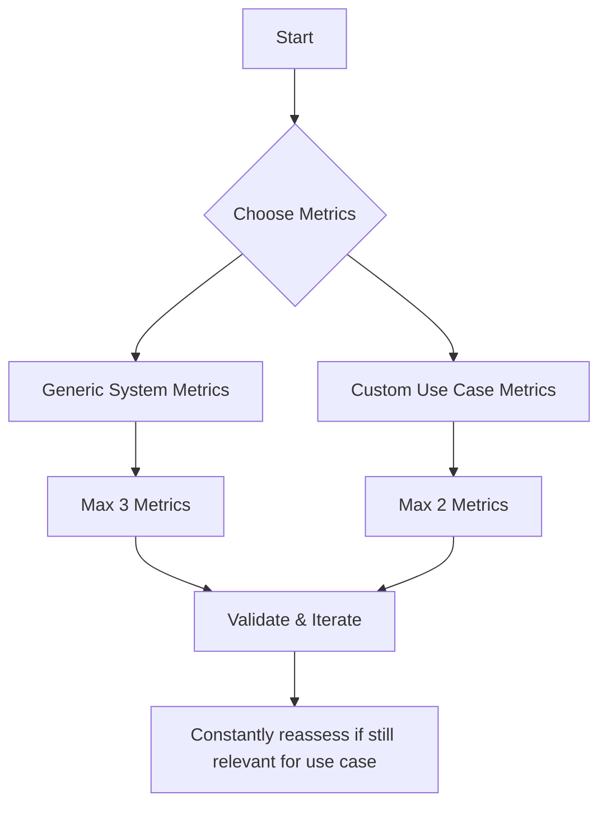

# Metrics

Metrics in Confident AI are standards of measurement for evaluating the performance of your LLM application based on specific criteria. They act as the ruler by which you measure your test cases, providing quantitative insights into how well your LLM is performing.

> [!TIP]
>
> Remember, metrics measure [test cases](/concepts/test-cases) (`LLMTestCase` or `ConversationalTestCase`), which represents interactions with your LLM application.

## Powered by DeepEval

All metrics in Confident AI are powered by DeepEval, an [open-source](https://github.com/confident-ai/deepeval) LLM evaluation framework. DeepEval runs 10M+ evals a week and provides the underlying implementation for 40+ metrics, ensuring consistent, reliable evaluation across your LLM applications. This integration means you benefit from:

- **Continuous improvements** as DeepEval evolves
- **Community contributions** to metric implementations
- **Standardized evaluation** across different projects
- **Seamless integration** between local development and Confident AI's cloud platform

When you use metrics in Confident AI, you're leveraging the same robust evaluation framework that powers DeepEval's hundreds and thousands of daily active users, with the added benefits of Confident AI's cloud infrastructure for tracking, analyzing, and sharing your evaluation results.

## LLM-as-Judge Approach

Confident AI uses an LLM-as-judge approach for all metrics, which offers several advantages:

- **Better alignment with human expectations** compared to traditional model-based approaches
- **Comprehensive reasoning** for the scores computed
- **Flexibility** to use any LLM for evaluation
- **Customizable evaluation prompts** to improve accuracy and stability
- **Reduced stochasticity and flakiness** in scores by using LLMs only for confined tasks

All metrics output a score between 0-1, with a default threshold of 0.5. A metric is considered successful if the evaluation score is equal to or greater than the threshold.

## Types of Metrics

Confident AI offers a wide range of metrics tailored to different LLM applications and use cases.

Metrics in Confident AI can be categorized based on whether they require reference data and where they run:

- **Custom Metrics**: These are use-case specific metrics like G-Eval or DAG that you tailor to your application's success criteria.
- **Generic Metrics**: These are system-architecture specific metrics (like RAG or agent metrics) that remain consistent across similar LLM applications.
- **Referenceless Metrics**: These don't require annotated datasets (no `expected_output` or `expected_tools` fields) and can evaluate your LLM's performance based on input and output alone.
- **Online Metrics**: These are specifically designed for production monitoring and observability. All online metrics are referenceless metrics.

All metrics can run in development, unlike online metrics which are referenceless and more suited for production. This flexibility in development allows you to curate datasets that are both labelled (with `expected_output`s) and not labelled (only `input`s).

### Custom Metrics

We recommend having 1-2 custom metrics in your evaluation suite and **NOT** rely 100% on generic, predefined metrics:

- **G-Eval**: A general-purpose evaluation metric for LLM outputs. More on [DeepEval's docs](https://docs.confident-ai.com/docs/metrics-llm-evals)
- **DAG (Deep Acyclic Graph)**: A decision-tree based LLM-evaluated metric. More on [DeepEval's docs](https://docs.confident-ai.com/docs/metrics-dag)

**Custom metrics are typically different based on your use case**, while system-specific metrics (like RAG or agent metrics) remain consistent across similar LLM applications. For example, two conversational agents - one for medical advice and another for legal consultation - would use the same agent metrics like tool correctness but have different `GEval` metrics tailored to their respective industry-specific success criteria.

> [!NOTE]
>
> Referenceless metrics are primarily used in production. In development, you typically have reference data available through your datasets, making referenceless metrics less necessary. You'll learn how to use referenceless metrics in production observability in the [Observability](/observability/enable-online-metrics) section, which we call online metrics on Confident AI.

### Generic Metrics

Generic metrics are metrics that are use case agnostic, and all that is required is pick the right ones based on your system architecture. If you're building something like agentic RAG, you can also select a combination of generic metrics in both the RAG and agentic metrics categories.

#### RAG

For Retrieval-Augmented Generation (RAG) systems:

- **Answer Relevancy**: Measures how relevant the LLM's response is to the user's query. More on [DeepEval's docs](https://docs.confident-ai.com/docs/metrics-answer-relevancy)
- **Faithfulness**: Evaluates whether the LLM's response is supported by the retrieved context. More on [DeepEval's docs](https://docs.confident-ai.com/docs/metrics-faithfulness)
- **Contextual Relevancy**: Assesses how relevant the retrieved context is to the query. More on [DeepEval's docs](https://docs.confident-ai.com/docs/metrics-contextual-relevancy)
- **Contextual Precision**: Measures the precision of the retrieved context. More on [DeepEval's docs](https://docs.confident-ai.com/docs/metrics-contextual-precision)
- **Contextual Recall**: Evaluates the recall of the retrieved context. More on [DeepEval's docs](https://docs.confident-ai.com/docs/metrics-contextual-recall)

#### Agentic

For LLM agents that use tools:

- **Tool Correctness**: Measures whether the agent used the correct tools for a given task. More on [DeepEval's docs](https://docs.confident-ai.com/docs/metrics-tool-correctness)
- **Task Completion**: Evaluates whether the agent successfully completed the assigned task. More on [DeepEval's docs](https://docs.confident-ai.com/docs/metrics-task-completion)

#### Conversational

For multi-turn conversational chatbots/agents:

- **Conversational G-Eval**: Evaluates the overall quality of a conversation. More on [DeepEval's docs](https://docs.confident-ai.com/docs/metrics-conversational-geval)
- **Knowledge Retention**: Measures how well the LLM retains information across conversation turns. More on [DeepEval's docs](https://docs.confident-ai.com/docs/metrics-knowledge-retention)
- **Role Adherence**: Evaluates how well the LLM adheres to its assigned role. More on [DeepEval's docs](https://docs.confident-ai.com/docs/metrics-role-adherence)
- **Conversation Completeness**: Measures whether the conversation addresses all aspects of the user's request. More on [DeepEval's docs](https://docs.confident-ai.com/docs/metrics-conversation-completeness)
- **Conversation Relevancy**: Evaluates how relevant each response is to the ongoing conversation. More on [DeepEval's docs](https://docs.confident-ai.com/docs/metrics-conversation-relevancy)

These are particular useful for text-based chatbots or conversational voice agents.

### Other Metrics

- **Json Correctness**: Evaluates the correctness of JSON outputs. More on [DeepEval's docs](https://docs.confident-ai.com/docs/metrics-json-correctness)
- **RAGAS**: Implements the RAGAS framework for RAG evaluation, no different than DeepEval's RAG metrics. More on [DeepEval's docs](https://docs.confident-ai.com/docs/metrics-ragas)
- **Hallucination**: Measures the extent to which the LLM generates information not present in the context. More on [DeepEval's docs](https://docs.confident-ai.com/docs/metrics-hallucination)
- **Toxicity**: Evaluates the toxicity level of LLM outputs. More on [DeepEval's docs](https://docs.confident-ai.com/docs/metrics-toxicity)
- **Bias**: Measures the presence of bias in LLM outputs. More on [DeepEval's docs](https://docs.confident-ai.com/docs/metrics-bias)
- **Summarization**: Evaluates the quality of summarization tasks. More on [DeepEval's docs](https://docs.confident-ai.com/docs/metrics-summarization)

### Referenceless Metrics

TODO: metrics are referencelss or reference-based. Referenceless means you don't need an annotated dataset, meaning fields on goldens like expected output and expected tools, and is only possible in development
TODO: a callout that says referneceless metrics are only possible in development because if you have a refernece in production theres no need fo ryour LLM app
TODO: you will learn how to exclusivelt use refernecelss metrics in production observability [here](link to observability online metrics), which we call online metrics on Confident AI

## Choosing the Right Metrics

Different LLM applications require different metrics for effective evaluation, and the specific combination of metrics depend on your LLM use case and application architecture.

As a general rule of thumb, **DO NOT**:

1. Use more than five metrics
2. Rely purely on generic metrics (there should be one or two custom metrics like `GEval` or `DAG`)
3. Pick metrics that don't have a clear success criteria

Point 3. is especially relevant to custom metrics like `GEval`, where you're writing your own criteria instead of relying on a predefined one.

### How to decide

When selecting metrics, consider both your LLM's **use case** and **system architecture**. The two are often interlinked - for example, a QA system might be implemented using RAG, while a copilot might combine both agent and conversational capabilities.

When selecting your **FIVE** metrics, aim for a balanced combination of:

1. **Two to three generic, system-specific metrics** (like answer relevancy and contextual relevancy for RAG systems, or tool correctness for agents) that evaluate core system capabilities
2. **One to two custom, use case specific metrics** (like GEval or DAG) that focus on your specific use case requirements, independent of the underlying system architecture

In fact, you'll find this pattern used when picking metrics for different use cases in the [use cases page.](/supported-use-cases) Here's a nice flow chart for the process:



Whichever metric that you find is a referenceless one in your final set of metrics, you can [enable it for online evaluation](/observability/online-metrics) in production.

> [!IMPORTANT]
>
> When selecting metrics, resist the temptation to add every metric that seems useful. Having too many metrics (>5) can dilute your evaluation focus and make results harder to interpret.
>
> Similarly, relying only on generic metrics without any custom ones tailored to your use case may miss important aspects of your application's performance. If you find yourself in either situation, step back and carefully reconsider your metric selection.

## Metric Implementation

Metrics are applied to test cases during evaluation. Each metric may require different parameters in your `LLMTestCase`. For example:

- RAG metrics typically require `retrieval_context`
- Agent metrics may need `tools_called` and `expected_tools`
- Conversational metrics work with `ConversationalTestCase`s

When running evaluations, you can use multiple metrics to get a comprehensive benchmark of your LLM application's performance:

```python copy showLineNumbers
from deepeval import evaluate
from deepeval.metrics import AnswerRelevancyMetric, FaithfulnessMetric
...

# Run evaluation with multiple metrics
evaluate(test_cases=[test_case], metrics=[
    AnswerRelevancyMetric(),
    FaithfulnessMetric()
])
```

## Can Metrics Run On The Cloud?

Yes, metrics can run on the cloud. However, we recommend starting with local evaluation first. Running metrics locally makes it easier to:

- Iterate quickly on accuracy and reliability
- Debug and fix issues
- Fine-tune metric implementations
- Validate metric accuracy

We suggest spending at least a week perfecting your metrics locally before moving to cloud evaluation. While this may temporarily limit access for non-technical team members, it ensures more robust and reliable metrics in the long run.

## Further Reading

For more detailed information on specific metrics and their implementation, refer to the [deepeval documentation](https://docs.confident-ai.com/docs/metrics-introduction). More resources on LLM evaluation metrics written by Confident AI's founders:

- [Everything on LLM evaluation metrics](https://www.confident-ai.com/blog/llm-evaluation-metrics-everything-you-need-for-llm-evaluation)
- [Why LLM-as-a-judge is the best evaluation method](https://www.confident-ai.com/blog/why-llm-as-a-judge-is-the-best-llm-evaluation-method)
- [Top LLM Chatbot Metrics](https://www.confident-ai.com/blog/llm-chatbot-evaluation-explained-top-chatbot-evaluation-metrics-and-testing-techniques)
- [How I built deterministic LLM evaluation metrics for DeepEval](https://www.confident-ai.com/blog/how-i-built-deterministic-llm-evaluation-metrics-for-deepeval)
