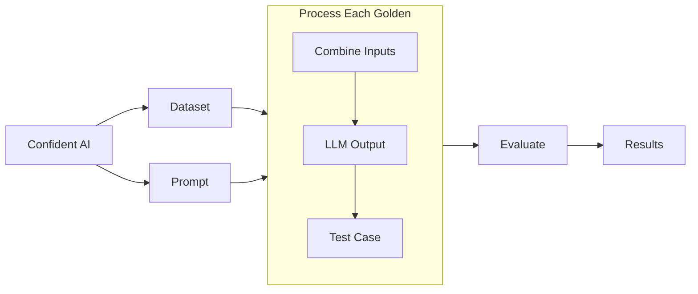

import { Callout } from "nextra/components";

# Run Your First LLM Eval

Let's run your first **end-to-end** evaluation and create a [test run](/concepts/test-runs). 

<details>

<summary>WHat is end-to-end evaluation?</summary>

[End-to-end evaluation](/llm-evaluation/run-evals/end-to-end-evals) refers to LLM evaluation where your LLM application is treated as a black-box, and only the system inputs and outputs are taken into account. When running end-to-end evaluations, you should only create test cases from the `input`s, `actual_outputs`s, and any other overarching parameter of your LLM system.

<Callout>

If you're looking for **component-level** evaluation instead, the [next section will show you how to set it up](/getting-started/setup-tracing).

</Callout>

</details>

By the end of this section, you'll have working code that executes this LLM evaluation workflow:



## Create a Dataset

Navigate to your project, go to the **Datasets** tab on the left navigation drawer. Click on **Create a dataset**, and provide your dataset with an alias.

Once you've created a dataset, you'll be directed to the **Dataset Editor** page for your newly created dataset. Depending on whether you already have [goldens](/concepts/datasets#goldens), you should either:

1. Upload a CSV file of your goldens to your dataset, OR
2. Create a golden, with the input as the text you typically prompt your LLM application with for testing

If you fall into category 2 where you don't already have a dataset, simply creating a golden very quickly with the input text you usually test your LLM application with is the best approach to get LLM evaluation setup.

<Callout>
  You can always add more goldens later on, but that can be done at a later time
  once you've gone through this quickstart guide.
</Callout>

## Pull Your Dataset

The evaluation process works as follows:

1. You pull and loop through each golden in your dataset
2. For each golden:
   - Combines the `input` with your prompt template
   - Generates an `actual_output`, and any other test case parameters such as `retrieval_context` using your LLM application
3. Creates a collection of test cases **in your dataset** ready for evaluation

Here's the example code:

```python showLineNumbers copy {6, 13, 15}
from deepeval.dataset import EvaluationDataset
from deepeval.test_case import LLMTestCase

# Pull your dataset from Confident AI
dataset = EvaluationDataset()
dataset.pull(alias="your-dataset-alias")

# Loop through each golden
for goldens in dataset.goldens:
    input = golden.input
    test_case = LLMTestCase(
        input=input,
        actual_output=your_llm_app(input) # Replace your_llm_app()
    )
    dataset.test_cases.append(test_case) # Add the test case back to your dataset
```

All that's left after this is to use `dataset.test_cases` for evaluation.

## Run Your First LLM Eval

In this example, we're going to use the answer relevancy metric (for the sake of simplicity) to run an evaluation using the test cases we've prepared:

<details>
  <summary>Configure Your Evaluation Model</summary>

  To run [LLM-as-a-judge metrics](/concepts/metrics#llm-as-judge-approach) with DeepEval, you'll need to set up an evaluation model. The simplest option is to use OpenAI's models as your LLM judge:

  ```bash
  export OPENAI_API_KEY=<your-openai-api-key>
  ```

  For notebook environments (Jupyter or Colab), use this syntax instead:

  ```bash
  %env OPENAI_API_KEY=<your-openai-api-key>
  ```

  Please **do not include** quotation marks when setting your `OPENAI_API_KEY` if you're working in a notebook enviornment as it is invalid syntax.

  > [!IMPORTANT]
  >
  > While OpenAI models are the simplest option, you can also use [other model providers](https://deepeval.com/integrations/models/azure-openai), [custom models](https://deepeval.com/guides/guides-using-custom-llms), or run evaluations [directly on Confident AI](/llm-evaluation/running-llm-evals#run-llm-evals-on-the-cloud). These advanced options are covered later in the documentation.

</details>

```python
from deepeval.metrics import AnswerRelevancyMetric
from deepeval import evaluate
...

# Define metric(s)
metric = AnswerRelevancyMetric()

# Run an evaluation
evaluate(test_cases=dataset.test_cases, metrics=[metric])
```

**Congratulations 🎉!** Your test run should now be available on Confident AI as a [testing report](/llm-evaluation/evaluation-features/testing-reports) ✅. Click around the testing report on Confident AI, and take tyour time to get familarized with it.

<VideoDisplayer
  src="https://confident-docs.s3.us-east-1.amazonaws.com/evaluation:testing-report.mp4"
  width="100%"
  title="FIRST LOOK: Testing Reports on Confident AI"
/>

<Callout type="warning">
  In this example we're using the `AnswerRelevancyMetric` simply for
  demonstration. Don't forget the fundamentals of [how to choose the best
  metrics](/concepts/metrics#choosing-the-right-metrics) for your use case and
  employ that when you're ready to mold this quickstart guide to your use case.
</Callout>

## Run Another Eval for Regression Testing

When you have multiple evaluation results, Confident AI allows you to regression test between different iterations of your LLM app.

**Before continuing, go make some changes to your LLM app.**

Now run the exact same code:

```python
from deepeval.dataset import EvaluationDataset
from deepeval.test_case import LLMTestCase
from deepeval.metrics import AnswerRelevancyMetric
from deepeval import evaluate
 
dataset = EvaluationDataset()
dataset.pull(alias="your-dataset-alias")
 
for goldens in dataset.goldens:
    input = golden.input
    test_case = LLMTestCase(
        input=input,
        actual_output=your_llm_app(input) # Hopefully you've made changes to your LLM app!
    )
    dataset.test_cases.append(test_case) # Add the test case back to your dataset

evaluate(test_cases=dataset.test_cases, metrics=[AnswerRelevancyMetric()])
```

**Congratulations 🎉!** Your second test run should now be available on Confident AI, but this time, you should see a comparison view to **Compare Test Results**. Select the previous test run, and start inspecting how this iteration of your LLM application differs from the previous one.

<VideoDisplayer
  src="https://confident-docs.s3.us-east-1.amazonaws.com/evaluation:ab-regression-testing.mp4"
  width="100%"
  title="LLM A|B regression testing 101"
/>

## What's Next?

In the next section, we showed how to run an end-to-end evaluation. But sometimes you may wish to run evals on a component-level, especially for agents. The next section will go through tracing, that will enable you to do that.
