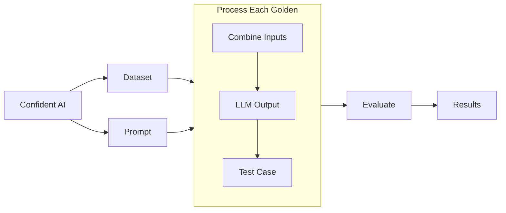

import { Callout } from "nextra/components";

# Run Your First LLM Eval

Now that you've created your prompt and dataset, let's run your first evaluation and create a [test run](/concepts/test-runs). By the end of this section, you'll have working code that executes this LLM evaluation workflow:



## Configure Your Evaluation Model

To run [LLM-as-a-judge metrics](/concepts/metrics#llm-as-judge-approach) with DeepEval, you'll need to set up an evaluation model. The simplest option is to use OpenAI's models as your LLM judge:

```bash
export OPENAI_API_KEY=<your-openai-api-key>
```

For notebook environments (Jupyter or Colab), use this syntax instead:

```bash
%env OPENAI_API_KEY=<your-openai-api-key>
```

Please **do not include** quotation marks when setting your `OPENAI_API_KEY` if you're working in a notebook enviornment as it is invalid syntax.

> [!IMPORTANT]
>
> While OpenAI models are the simplest option, you can also use [other model providers](https://deepeval.com/integrations/models/azure-openai), [custom models](https://deepeval.com/guides/guides-using-custom-llms), or run evaluations [directly on Confident AI](/llm-evaluation/running-llm-evals#run-llm-evals-on-the-cloud). These advanced options are covered later in the documentation.

## Pull Your Prompt and Dataset

Your evaluation will use two key components from Confident AI:

1. **Prompt**: This serves two purposes:

   - Generates outputs from your LLM application
   - Links to your evaluation results

2. **Dataset**: Contains the test cases for evaluation

The evaluation process works as follows:

1. You pull and loop through each golden in your dataset
2. For each golden:
   - Combines the `input` with your prompt template
   - Generates an `actual_output`, and any other test case parameters such as `retrieval_context` using your LLM application
3. Creates a collection of test cases **in your dataset** ready for evaluation

Here's the example code:

```python showLineNumbers copy
from deepeval.dataset import EvaluationDataset
from deepeval.prompt import Prompt
from deepeval.test_case import LLMTestCase

# Initialize and pull your dataset from Confident AI
dataset = EvaluationDataset()
# Replace "My Evals Dataset" with your actual dataset alias
dataset.pull(alias="My Evals Dataset")

# Replace "System Prompt" with your actual prompt alias from Confident AI
prompt = Prompt(alias="System Prompt")
prompt.pull()

# Process each golden in your dataset
for goldens in dataset.goldens:
    input = golden.input

    # Create a test case with the input and your LLM's output
    test_case = LLMTestCase(
        input=input,
        # Replace your_llm_app() with your actual LLM application function
        actual_output=your_llm_app(input, prompt)
    )

    # Add the test case to your dataset for evaluation
    dataset.test_cases.append(test_case)
```

All that's left after this is to use `dataset.test_cases` for evaluation.

## Run Your First LLM Eval

In this example, we're going to use the answer relevancy metric (for the sake of simplicity) to run an evaluation using the test cases we've prepared:

```python
from deepeval.metrics import AnswerRelevancyMetric
from deepeval import evaluate
...

# Define metric(s)
metric = AnswerRelevancyMetric()

# Run an evaluation
evaluate(
    test_cases=dataset.test_cases,
    metrics=[metric],
    hyperparameters={"System Prompt": prompt}
)
```

Congratulations 🎉! Your test run should now be available on Confident AI as a [testing report](/llm-evaluation/testing-reports) ✅. Click around the testing report on Confident AI, and take tyour time to get familarized with it.

<VideoDisplayer
  src="https://confident-docs.s3.us-east-1.amazonaws.com/evaluation:testing-reports.mp4"
  width="100%"
  title="FIRST LOOK: Testing Reports on Confident AI"
/>

<Callout type="warning">
  In this example we're using the `AnswerRelevancyMetric` simply for
  demonstration. Don't forget the fundamentals of [how to choose the best
  metrics](/concepts/metrics#choosing-the-right-metrics) for your use case and
  employ that when you're ready to mold this quickstart guide to your use case.
</Callout>

## What's Next?

In the next section, we'll be improving your LLM application by tweaking the `"System Prompt"` based on the test run results. Although the test case(s) you've just ran is **most likely passing**, we'll stil walkthrough the improvements we can be making.
