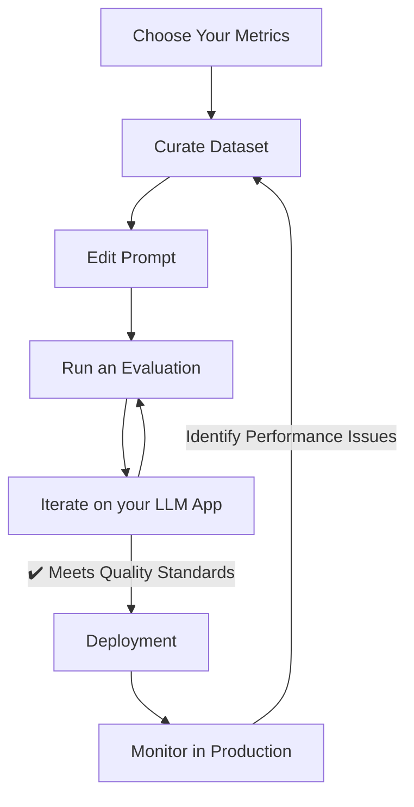

import { Steps } from "nextra/components";
import { Callout } from "nextra/components";

# The Perfect LLM Evaluation Workflow

Confident AI is built around the perfect LLM evaluation workflow. LLM evaluation is the product of great metrics and datasets, and a systematic approach to testing and iteration.



> [!IMPORTANT]
>
> This guide walks you through both basic and advanced evaluation workflows to help you build more reliable and effective LLM systems, and is a meant to be a high level overview only.

By following a structured evaluation process, you can continuously improve your LLM applications, identify performance bottlenecks, and ensure your models meet the quality standards required for production deployment.

## Basic Setup

These are the list of tasks that you must get right in order to start using Confident AI.

<Callout>
  If there's any terminology you don't understand, we recommend first reading
  the [list of concepts](/concepts/test-cases) before continuing.
</Callout>

<Steps>
### Choose Your Metrics

Select **TWO to FIVE** metrics to evaluate your LLM application. We recommend 1-2 **custom metrics** that are use case specific, while 2-3 **default metrics** specific to the architecture of your LLM app (e.g. RAG, agents, agentic RAG, conversational chatbots, etc.)

You can read up on the best practices for metrics selection and the rationale behind it [here.](/concepts/metrics#choosing-the-right-metrics) The metrics you have chosen can be used locally either through DeepEval or on the cloud.

### Prepare Your Prompt

Write or paste in your first prompt on Confident AI's [prompt studio](/prompt-studio/overview). This will allow you to use it for evaluation as well as test it for your use case.

Both text and messages prompts are supported.

### Prepare Your Dataset

Curate ~100 [goldens for datasets](/concepts/datasets) on Confident AI to start with, that you can use to test your LLM application on. All your metrics will be used to evaluate [test cases](/concepts/test-cases) that result from the goldens in your dataset. These are two common scenarios you'll find yourself in:

- You already have a dataset
- You don't have a dataset

If you already have a dataset, you can import it as CSV by uploading it on Confident AI, or upload it via DeepEval in code. If you don't already have a dataset, you can either:

- Synthetize goldens either yourself using DeepEval or ask us to help you do it
- Start with a small number (~5-10) goldens and start from there

<Callout type="warning">
  We will show you how to [curate datasets on Confident
  AI](/dataset-editor/annotate-datasets) in later sections.
</Callout>

### Run an Evaluation

Using the `input`s of the goldens in your prepared dataset, prompt, and your LLM application, generate all the necessary values for test cases, before running an evaluation:

```python showLineNumbers copy
from deepeval.dataset import EvaluationDataset
from deepeval.metrics import AnswerRelevancyMetric
from deepeval.prompt import Prompt
from deepeval import evaluate


# Pull dataset
dataset = EvaluationDataset()
dataset.pull(alias="First dataset")


# Pull prompt
prompt = Prompt(alias="System Prompt")
prompt.pull()


# Populate test cases
for golden in dataset.goldens:
    prompt_to_llm = prompt.interpolate(golden.input)
    test_case = LLMTestCase(
        input=golden.input,
        actual_output=your_llm_app(prompt_to_llm) # Replace with your app
    )
    dataset.test_cases.append(test_case)


# Define metrics
metric = AnswerRelevancyMetric()


# Run evaluation
evaluate(test_cases=dataset.test_cases, metrics=[metric])
```

This creates a [test run](/concepts/test-runs) on Confident AI, which you can use to run A|B experiments, share testing reports of, regression test performance, and so much more.

### Repeat After Each Iteration

Once you've identified the failing test cases and why they are failing, iterate on your LLM application. The lowest hanging fruit is usually to improve your prompt templates, or try a different model. Run another evaluation once you're done to validate the changes you've made.

</Steps>

## Advanced Setup

These are the list of tasks that is equally if not more important, but likely won't be something you'll be doing on your first day of using Confident AI.

<Steps>

### Improve Test Coverage

Expand your dataset to include a diverse range of test cases that cover different aspects of your LLM application's functionality. Aim for 500-1000 goldens that represent:

- **Edge cases**: Unusual inputs that might challenge your model
- **Domain-specific scenarios**: Examples from your specific industry or use case
- **Failure modes**: Known areas where your model might struggle
- **User personas**: Different types of users with varying needs and expectations

Consider using techniques like:

- **Synthetic data generation**: Create test cases programmatically
- **Adversarial testing**: Deliberately craft inputs to test robustness
- **User feedback integration**: Incorporate real user interactions as test cases
- **A/B testing results**: Use successful and failed examples from previous experiments

A comprehensive test suite helps identify subtle performance issues and ensures your model performs well across all scenarios.

### Align Metric Scores

To ensure your metrics accurately reflect the quality of your LLM application, start with manual annotation of a subset of test cases. This process involves:

- **Reviewing false positives**: Cases where metrics gave high scores to poor outputs
- **Analyzing false negatives**: Cases where metrics gave low scores to good outputs
- **Identifying patterns**: Common characteristics of misclassified outputs

This manual review helps you understand where your metrics are failing to align with human judgment and what adjustments are needed. To align metric scores, you can either do it manually on DeepEval or contact support@confident-ai.com.

<Callout type="info">
  While annotating metrics may seem like a lot of work initially, spending time
  to annotate 20-40 metric scores per week saves you tens of hours that would
  otherwise be spent manually evaluating hundreds of test cases each day.
</Callout>

### Implement Tracing

LLM tracing is primarily valuable for agentic workflows, where it enables component-level evaluation of complex systems. By implementing [tracing on Confident AI](/llm-observability/llm-tracing), you can:

- **Track tool usage**: Monitor which tools your agent selects and how effectively they're used
- **Evaluate multiple retrieval components**: Assess the performance of different retrieval strategies, embedding models, and reranking approaches to identify the most effective combination
- **Identify latency, cost, and agent handoffs**: Track performance metrics across your system to optimize resource usage and identify inefficiencies in agent-to-agent communication
- **Debug component failures**: Pinpoint exactly where and why specific components of your agentic system are failing

<Callout type="warning">
  While tracing provides valuable insights, avoid the trap of trying to evaluate
  everything. Focus on tracing the most critical components that directly impact
  your application's performance. Over-evaluation can lead to analysis paralysis
  and divert resources from more important improvements.
</Callout>

For effective tracing, implement structured logging in your agent's code that captures key decision points, tool calls, and intermediate outputs. This data can then be used to evaluate specific components of your agentic system and identify areas for targeted improvement.

### Customize Accordingly Based on Use Case

Different [LLM use cases](/llm-use-cases) need different evaluation approaches. As your product evolves, test coverage and metrics may become less effective over time due to shifting use cases and features. Regularly reassess to ensure your evaluation strategy stays aligned with your application's current needs.

</Steps>

## What's Next?

In the next section, we're go through everything you need in order to get started with Confident AI to setup the perfect LLM evaluation workflow.
