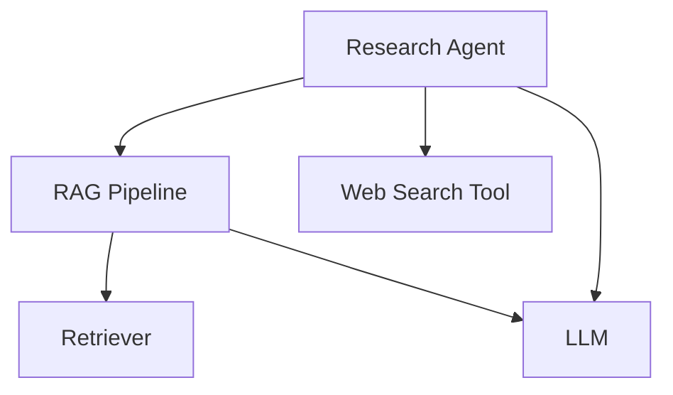

import { Callout } from "nextra/components";

# LLM Tracing (JS/TS)

With LLM tracing, Confident AI allows you to visualize and analyze component‑level performance throughout your LLM application's workflows. In addition to [Python decorators](/llm-observability/llm-tracing), Confident AI also supports JavaScript/TypeScript wrapper functions to easily capture traces in JS/TS-native applications.

<Callout type="info">
  Tracing originates from traditional software telemetry practices, where individual
  components of your LLM application (retrievers, tools, etc.) are represented
  as **SPANS**, while the complete execution flow and call hierarchy is
  visualized as a **TRACE**. You can think of tracing as building a graph view of your LLM app.

</Callout>

Confident AI's tracing implementation for JS/TS is designed to be non-intrusive and effective, with:

- Zero code restructuring - wrap your existing functions with provided wrappers
- Background execution - no performance impact on your application
- Silent failure handling - your application continues running without interruption
- Compatibility with any function signature - runtime attribute updates let you customize what's captured
- Support for [online metrics](/llm-observability/online-metrics) - evaluate spans and traces in production

## Installation

Before using the tracing functionality in your TypeScript/JavaScript application, follow these steps to install and initialize the DeepEval JS/TS SDK:

### 1. Install the package

```bash
npm install deepeval-ts
# or
yarn add deepeval-ts
```

### 2. Set environment variables

The SDK requires your Confident AI API key to be set as an environment variable:

```bash
# In your .env file or environment
CONFIDENT_API_KEY=your-api-key
```

> **Note:** The SDK automatically detects and uses these environment variables without requiring explicit initialization code.

## Code & Video Summary

Here's a concise example of tracing in a TypeScript application (same architecture as the Python example):



```tsx showLineNumbers copy {13, 22, 42, 58, 74}
import {
  observeTool,
  observeRetriever,
  observeLLM,
  observeCustom,
  observeAgent,
  updateCurrentSpanAttributes,
  RetrieverAttributes,
  LlmAttributes,
} from "deepeval-ts/tracing";

// Tool
const webSearch = observeTool(
  async (query: string): Promise<string> => {
    // <--Include implementation to search web here-->
    return "Latest search results for: " + query;
  },
  { name: "web_search" }
);

// Retriever
const retrieveDocuments = observeRetriever(
  async (query: string): Promise<string[]> => {
    // <--Include implementation to fetch from vector database here-->
    const fetchedDocuments = [
      "Document 1: This is relevant information about the query.",
      "Document 2: More relevant information here.",
      "Document 3: Additional context that might be useful.",
    ];

    updateCurrentSpanAttributes({
      embeddingInput: query,
      retrievalContext: fetchedDocuments,
    });

    return fetchedDocuments;
  },
  { embedder: "text-embedding-ada-002" }
);

// LLM
const generateResponse = observeLLM(
  async (input: string): Promise<string> => {
    // <--Include format prompts and call your LLM provider here-->
    const output = "Generated response based on the prompt: " + input;

    updateCurrentSpanAttributes({
      input: input,
      output: output,
    });

    return output;
  },
  { model: "gpt-4" }
);

// Custom span wrapping the RAG pipeline
const ragPipeline = observeCustom(
  async (query: string): Promise<string> => {
    // Retrieve
    const docs = await retrieveDocuments(query);
    const context = docs.join("\n");

    // Generate
    const response = await generateResponse(
      `Context: ${context}\nQuery: ${query}`
    );
    return response;
  },
  { type: "custom", name: "RAG Pipeline" }
);

// Agent that does RAG + tool calling
const researchAgent = observeAgent(
  async (query: string): Promise<string> => {
    // Call RAG pipeline
    const initialResponse = await ragPipeline(query);

    // Use web search tool on the results
    const searchResults = await webSearch(initialResponse);

    // Generate final response incorporating both RAG and search results
    const finalResponse = await generateResponse(
      `Initial response: ${initialResponse}\n` +
        `Additional search results: ${searchResults}\n` +
        `Query: ${query}`
    );
    return finalResponse;
  },
  { name: "Research Agent", availableTools: ["web_search"] }
);

// Calling the agent will create traces on Confident AI
researchAgent("What is the weather like in San Francisco?");
```

<VideoDisplayer
  src="https://confident-docs.s3.us-east-1.amazonaws.com/observability:llm-tracing.mp4"
  width="100%"
  title="LLM Tracing for an Agentic RAG App"
/>

## Key Differences from Python SDK

### Wrapper Functions vs Decorators

Instead of Python’s `@observe` decorators, the JS/TS SDK uses wrapper functions. Below is a mapping of each Python decorator to its JavaScript/TypeScript wrapper equivalent. In the sections below, we'll see how to use these wrappers in practice.

| Python Decorator             | TypeScript/JavaScript Wrapper |
| ---------------------------- | ----------------------------- |
| `@observe(type="llm")`       | `observeLLM()`                |
| `@observe(type="retriever")` | `observeRetriever()`          |
| `@observe(type="tool")`      | `observeTool()`               |
| `@observe(type="agent")`     | `observeAgent()`              |
| `@observe(type="custom")`    | `observeCustom()`             |

## Terminologies for Tracing

Tracing in Confident AI consists of several key concepts:

- **Tracing**: The overall process of tracking and visualizing the execution flow of your LLM application
- **Spans**: Individual units of work within your application (e.g., LLM calls, tool executions, retrievals)
- **Attributes**: Properties that can be attached to spans to provide additional context and metadata
- **Default Span Types**: Pre-defined span types (Agent, Tool, Retriever, LLM) that come with specific attributes
- **Custom Spans**: User-defined spans for grouping or categorizing other spans

## Using the `observeXXX` Wrappers

The `observeXXX` wrappers are the primary way to instrument your LLM application for tracing. They are a set of wrapper functions that provide domain-specific tracing for different types of spans.

<Callout type="warning">
  Each `observeXXX` wrapper **CREATES A SPAN**, and **MANY SPANS MAKE UP A
  TRACE**.
</Callout>

Here's how to use it. We'll use `observeLLM` as an example:

```tsx
import { observeLLM } from "deepeval-ts/tracing";

const tracedFunction = observeLLM(
  originalFunction, // Your function to be traced
  {
    model: "gpt-4", // Configuration parameters specific to the span type
  }
);
```

Unlike Python decorators which are placed above function definitions, JavaScript/TypeScript wrapper functions take your original function as the first argument, followed by a configuration object containing the span parameters.

## Different Types of Spans

Confident AI offers five span types to instrument different parts of your LLM application. These built‑in spans cover common workflows yet remain fully customizable. For example, in an agentic RAG setup, you can nest retriever and LLM spans inside a custom “RAG Pipeline” span before invoking tool calls.

### LLM Span

An LLM span represents a call to a language model. It tracks the input, output, and token usage of the model.

```tsx
import { observeLLM } from "deepeval-ts/tracing";

const generateResponse = observeLLM(
  async (prompt: string): Promise<string> => {
    // Your LLM logic here
    return "LLM response";
  },
  { model: "gpt-4" }
);
```

There are **TWO** mandatory and **FOUR** optional parameters when configuring an LLM span:

- `model`: A string representing the name of the LLM used.
- `type`: This is handled automatically by the wrapper function and set to `"llm"`.
- [Optional] `costPerInputToken`: A number specifying the cost per input token. Defaults to undefined.
- [Optional] `costPerOutputToken`: A number specifying the cost per output token. Defaults to undefined.
- [Optional] `name`: A string specifying the display name on Confident AI. Defaults to the name of the wrapped function.
- [Optional] `metrics`: An array of strings specifying the names of the online metrics you wish to run upon tracing to Confident AI. Learn more about using online metrics in the [next section here.](/llm-observability/online-metrics)

### Retriever Span

A Retriever span represents a component that fetches information from a vector store or knowledge base.

```tsx
import { observeRetriever } from "deepeval-ts/tracing";

const retrieveDocuments = observeRetriever(
  async (query: string): Promise<string[]> => {
    // Your retrieval logic here
    return ["document1", "document2"];
  },
  { embedder: "text-embedding-ada-002" }
);
```

There is **ONE** mandatory and **THREE** optional parameters when configuring a retriever span:

- `embedder`: A string representing the name of the embedding model used.
- `type`: This is handled automatically by the wrapper function and set to `"retriever"`.
- [Optional] `name`: A string specifying the display name on Confident AI. Defaults to the name of the wrapped function.
- [Optional] `metrics`: An array of strings specifying the names of the online metrics you wish to run upon tracing to Confident AI. Learn more about using online metrics in the [next section here.](/llm-observability/online-metrics)

### Tool Span

A Tool span represents a function that an agent can call to perform specific tasks.

```tsx
import { observeTool } from "deepeval-ts/tracing";

const webSearch = observeTool(
  async (query: string): Promise<string> => {
    // Your tool implementation
    return "Search results";
  },
  {
    name: "web_search",
    description: "Search the web for information",
  }
);
```

There is **ONE** mandatory and **THREE** optional parameters when configuring a tool span:

- `name`: A string specifying the name of the tool.
- `type`: This is handled automatically by the wrapper function and set to `"tool"`.
- [Optional] `description`: A string that describes what the tool does.
- [Optional] `metrics`: An array of strings specifying the names of the online metrics you wish to run upon tracing to Confident AI. Learn more about using online metrics in the [next section here.](/llm-observability/online-metrics)

### Agent Span

An Agent span represents an autonomous entity that can make decisions and interact with other components.

```tsx
import { observeAgent } from "deepeval-ts/tracing";

const researchAgent = observeAgent(
  async (query: string): Promise<string> => {
    // Your agent implementation
    return "Agent response";
  },
  {
    name: "Research Agent",
    availableTools: ["web_search", "calculator"],
  }
);
```

There is **ONE** mandatory and **FOUR** optional parameters when configuring an agent span:

- `name`: A string specifying the display name on Confident AI. Defaults to the name of the wrapped function.
- `type`: This is handled automatically by the wrapper function and set to `"agent"`.
- [Optional] `availableTools`: An array of strings representing available tools.
- [Optional] `agentHandoffs`: An array of strings representing other agents this agent can delegate to.
- [Optional] `metrics`: An array of strings specifying the names of the online metrics you wish to run upon tracing to Confident AI. Learn more about using online metrics in the [next section here.](/llm-observability/online-metrics)

Agents can be nested within other agents, which is useful for implementing hierarchical agent architectures. For instance, a "supervisor" agent might coordinate communication between specialized agents.

### Custom Span

Custom spans are essential for creating hierarchical structures or grouping related spans together.

```tsx
import { observeCustom } from "deepeval-ts/tracing";

const customProcess = observeCustom(
  async (input: string): Promise<string> => {
    // Your custom implementation
    return "Result";
  },
  {
    type: "custom",
    name: "Custom Process",
  }
);
```

There is **ONE** mandatory and **TWO** optional parameters when configuring a custom span:

- `type`: The type of span. Must be set to `"custom"` for custom spans.
- [Optional] `name`: A string specifying how this custom span is displayed on Confident AI. Defaults to the name of the wrapped function.
- [Optional] `metrics`: An array of strings specifying the names of the online metrics you wish to run upon tracing to Confident AI. Learn more about using online metrics in the [next section here.](/llm-observability/online-metrics)

## Set Runtime Attributes for Default Spans

Attributes can be set at runtime by using the `updateCurrentSpanAttributes()` function. This updates the attributes for the **CURRENT** span in the execution context.

```tsx
import { updateCurrentSpanAttributes } from "deepeval-ts/tracing";

// Python equivalent: update_current_span_attributes(LlmAttributes(input=prompt, output=response))
updateCurrentSpanAttributes({
  input: prompt,
  output: response,
});
```

The current span is determined using JavaScript's async context, which automatically tracks the active span. This means you don't need to manually pass span references around - the system knows which span is currently executing.

<Callout>
  Runtime attributes help you integrate tracing with minimal code changes. For
  example, if your retriever function returns complex objects instead of just
  strings, you can keep your original return type and separately set the
  `retrievalContext` attribute for tracing purposes using
  `updateCurrentSpanAttributes()`.
</Callout>

### LLM Attributes

LLM attributes track the input, output, and token usage of language model calls:

```tsx
import { updateCurrentSpanAttributes } from "deepeval-ts/tracing";

updateCurrentSpanAttributes({
  input: "What is the capital of France?",
  output: "The capital of France is Paris.",
  inputTokenCount: 7,
  outputTokenCount: 7,
});
```

There are **TWO** mandatory and **TWO** optional parameters for LLM attributes:

- `input`: The prompt or text string sent to the language model.
- `output`: The response generated string by the language model.
- [Optional] `inputTokenCount`: The number of tokens in the input.
- [Optional] `outputTokenCount`: The number of tokens in the generated response.

<Callout type="info">
  If `costPerInputToken` is not set in the wrapper configuration, setting the
  LLM attributes for `inputTokenCount` will not help calculate the cost. The
  same applies to output tokens.
</Callout>

### Retriever Attributes

Retriever attributes track the query, retrieved documents, and related metadata:

```tsx
import { updateCurrentSpanAttributes } from "deepeval-ts/tracing";

updateCurrentSpanAttributes({
  embeddingInput: "Query to embed",
  retrievalContext: ["Document 1", "Document 2"],
});
```

There are **TWO** mandatory and **TWO** optional parameters for Retriever attributes:

- `embeddingInput`: The text string that needs to be embedded for vector search.
- `retrievalContext`: An array of strings representing the relevant documents or text chunks retrieved from your vector store.

### Tool Attributes

Tool attributes track the input parameters and output of tool executions:

```tsx
import { updateCurrentSpanAttributes } from "deepeval-ts/tracing";

updateCurrentSpanAttributes({
  inputParameters: { query: "Search query" },
  output: "Search results",
});
```

There are **TWO** optional parameters for Tool attributes:

- [Optional] `inputParameters`: An object containing the parameters passed to the tool function.
- [Optional] `output`: The result of any type returned by the tool function.

> [!TIP]
>
> If `updateCurrentSpanAttributes` is not called for a tool span, the system
> will automatically take the input and outputs of the function as the
> `inputParameters` and `output`.

### Agent Attributes

Agent attributes track the input and output of agent executions:

```tsx
import { updateCurrentSpanAttributes } from "deepeval-ts/tracing";

updateCurrentSpanAttributes({
  input: "User query",
  output: "Agent response",
});
```

There are **TWO** optional parameters for Agent attributes:

- `input`: The input to the agent, typically the initial query or task description.
- `output`: The agent's response or output, including any actions taken or results produced.

<Callout type="info">
  Similar to the tool span, an agent span will take the wrapped function's input
  and output as the `input` and `output` of its attributes if not explicitly
  set.
</Callout>

## View Traces in Observatory

To view your traces, navigate to the **Observatory** page under your project space in Confident AI. Here you'll find detailed visualizations of your LLM application's execution flow, including span hierarchies, timing information, and error tracking. You can also open up your trace in full-screen for better visuals.

The trace visualization works exactly the same way regardless of whether you used the Python or TypeScript/JavaScript SDK to generate the traces. All span types (LLM, Retriever, Tool, Agent, Custom) are displayed with their hierarchical relationships, making it easy to analyze your application's performance and behavior.

For a more detailed walkthrough, please refer to the [video summary in the Python documentation](/llm-observability/llm-tracing#code--video-summary).
