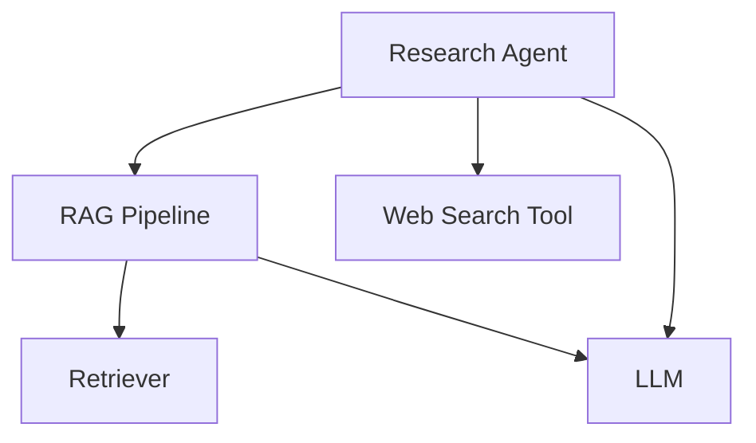

import { Callout } from "nextra/components";

# LLM Tracing (JS/TS)

With LLM tracing, Confident AI allows you to visualize and analyze component‑level performance throughout your LLM application's workflows. In addition to `DeepEval` [decorators](/llm-observability/llm-tracing), Confident AI also supports JavaScript and TypeScript wrapper functions to easily capture traces in JS/TS-native applications through `DeepEval.ts`.

<Callout type="info">
  Tracing originates from traditional software telemetry practices, where
  individual components (retrievers, tools, etc.) are represented as **SPANS**,
  while the complete call hierarchy is visualized as a **TRACE**. To learn more
  about tracing terminologies, refer to [DeepEval's tracing
  documentation](/llm-observability/llm-tracing#terminologies-for-tracing).
</Callout>

`DeepEval.ts`'s tracing implementation is designed to be non-intrusive and effective, with:

- Zero code restructuring - wrap your existing functions with provided wrappers
- Background execution - no performance impact on your application
- Silent failure handling - your application continues running without interruption
- Compatibility with any function signature - runtime attribute updates let you customize what's captured
- Support for [online metrics](/llm-observability/online-metrics) - evaluate spans and traces in production

## Installation

<Callout type="tip">
  From here onwards: we will refer to DeepEval's python implementation simply as
  `DeepEval`, and the JavaScript/TypeScript implementation as `DeepEval.ts`
</Callout>

Before using the tracing functionality in your LLM application, follow these steps
to install `DeepEval.ts`:

### 1. Install the package

```bash
npm install deepeval-ts
# or
yarn add deepeval-ts
```

### 2. Set environment variables

The SDK requires your Confident AI API key to be set as an environment variable:

```bash
# In your .env file or environment
CONFIDENT_API_KEY=your-api-key
```

## Code & Video Summary

Here's a concise example of tracing in a TypeScript LLM application:



```tsx showLineNumbers copy {13, 22, 42, 60, 77}
import {
  ObserveTool,
  ObserveRetriever,
  ObserveLLM,
  ObserveCustom,
  ObserveAgent,
  updateCurrentSpanAttributes,
  RetrieverAttributes,
  LlmAttributes,
} from "deepeval-ts/tracing";

// Tool
const webSearch = ObserveTool({
  name: "web_search",
  fn: async (query: string) => {
    // <--Include implementation to search web here-->
    return "Latest search results for: " + query;
  },
});

// Retriever
const retrieveDocuments = ObserveRetriever({
  embedder: "text-embedding-ada-002",
  fn: async (query: string) => {
    // <--Include implementation to fetch from vector database here-->
    const fetchedDocuments = [
      "Document 1: This is relevant information about the query.",
      "Document 2: More relevant information here.",
      "Document 3: Additional context that might be useful.",
    ];

    updateCurrentSpanAttributes({
      embeddingInput: query,
      retrievalContext: fetchedDocuments,
    });

    return fetchedDocuments;
  },
});

// LLM
const generateResponse = ObserveLLM({
  model: "gpt-4",
  fn: async (input: string) => {
    // <--Include format prompts and call your LLM provider here-->
    const output = "Generated response based on the prompt: " + input;

    updateCurrentSpanAttributes({
      input: input,
      output: output,
      inputTokenCount: 10,
      outputTokenCount: 20,
    });

    return output;
  },
});

// Custom span wrapping the RAG pipeline
const ragPipeline = ObserveCustom({
  type: "custom",
  name: "RAG Pipeline",
  fn: async (query: string) => {
    // Retrieve
    const docs = await retrieveDocuments(query);
    const context = docs.join("\n");

    // Generate
    const response = await generateResponse(
      `Context: ${context}\nQuery: ${query}`
    );
    return response;
  },
});

// Agent that does RAG + tool calling
const researchAgent = ObserveAgent({
  name: "Research Agent",
  availableTools: ["web_search"],
  fn: async (query: string) => {
    // Call RAG pipeline
    const initialResponse = await ragPipeline(query);

    // Use web search tool on the results
    const searchResults = await webSearch(initialResponse);

    // Generate final response incorporating both RAG and search results
    const finalResponse = await generateResponse(
      `Initial response: ${initialResponse}\n` +
        `Additional search results: ${searchResults}\n` +
        `Query: ${query}`
    );
    updateCurrentSpanAttributes({
      thought: "Using RAG and web search to answer the query",
      plan: "Call RAG pipeline, then use web search tool",
      selectedTool: "web_search",
      input: query,
      output: finalResponse,
    });
    return finalResponse;
  },
});

// Calling the agent will create traces on Confident AI
researchAgent("What is the weather like in San Francisco?");
```

<VideoDisplayer
  src="https://confident-docs.s3.us-east-1.amazonaws.com/observability:llm-tracing.mp4"
  width="100%"
  title="LLM Tracing for an Agentic RAG App"
/>

## Key Differences from `DeepEval`

### Wrapper Functions vs Decorators

Instead of `DeepEval`'s `@observe` decorators, the `DeepEval.ts` uses wrapper functions. Below is a mapping of each `DeepEval` decorator to its `DeepEval.ts` wrapper equivalent. In the sections below, we'll see how to use these wrappers in practice.

| `DeepEval`                   | `DeepEval.ts`        |
| ---------------------------- | -------------------- |
| `@observe(type="llm")`       | `ObserveLLM()`       |
| `@observe(type="retriever")` | `ObserveRetriever()` |
| `@observe(type="tool")`      | `ObserveTool()`      |
| `@observe(type="agent")`     | `ObserveAgent()`     |
| `@observe(type="custom")`    | `ObserveCustom()`    |

## Using the `Observe` Wrappers

The `Observe` wrappers are the primary way to instrument your LLM application for tracing. They are a set of wrapper functions that provide domain-specific tracing for different types of spans.

For example, let's take a look at an LLM generation function:

```tsx showLineNumbers
// Your original function
const generateCompletion = async (input: string) => {
  ...
  return generatedResponse;
};
```

To instrument the function as a span, wrap it with `ObserveLLM`. Unlike `DeepEval` decorators which modify functions in-place, `DeepEval.ts` wrapper functions accepts both span parameters and the function to be traced.

```tsx showLineNumbers
import { ObserveLLM } from "deepeval-ts/tracing";

// Wrap the function with ObserveLLM
const generateCompletion = ObserveLLM({
  model: "gpt-4", // parameters specific to the span type
  fn: async (input: string) => {
    ...
    return generatedResponse;
  },
});
```

## Different Types of Spans

Confident AI offers five span types to instrument different parts of your LLM application. You may read more about these span types in [DeepEval's tracing documentation.](/llm-observability/llm-tracing#span-types)

### LLM Span

An LLM span represents a call to a language model. It tracks the input, output, and token usage of the model.

```tsx showLineNumbers
import { ObserveLLM } from "deepeval-ts/tracing";

// Original function
const generateLLMResponse = async (prompt: string) => {
  ...
  return "LLM response";
};

// Wrapped with ObserveLLM
const generateLLMResponse = ObserveLLM({
  model: "gpt-4",
  fn: async (prompt: string) => {
    ...
    return "LLM response";
  },
});
```

There are **ONE** mandatory and **FOUR** optional parameters when configuring an LLM span:

- `model`: A string representing the name of the LLM used.
- [Optional] `costPerInputToken`: A number specifying the cost per input token. Defaults to undefined.
- [Optional] `costPerOutputToken`: A number specifying the cost per output token. Defaults to undefined.
- [Optional] `name`: A string specifying the display name on Confident AI. Defaults to the name of the wrapped function.
- [Optional] `metrics`: An array of strings specifying the names of the online metrics you wish to run upon tracing to Confident AI. Learn more about using online metrics in the [next section here.](/llm-observability/online-metrics)

### Retriever Span

A Retriever span represents a component that fetches information from a vector store or knowledge base.

```tsx showLineNumbers
import { ObserveRetriever } from "deepeval-ts/tracing";

// Original function
const fetchDocuments = async (query: string) => {
  ...
  return ["document1", "document2"];
};

// Wrapped with ObserveRetriever
const fetchDocuments = ObserveRetriever({
  embedder: "text-embedding-ada-002",
  fn: async (query: string) => {
    ...
    return ["document1", "document2"];
  },
});
```

There is **ONE** mandatory and **TWO** optional parameters when configuring a retriever span:

- `embedder`: A string representing the name of the embedding model used.
- [Optional] `name`: A string specifying the display name on Confident AI. Defaults to the name of the wrapped function.
- [Optional] `metrics`: An array of strings specifying the names of the online metrics you wish to run upon tracing to Confident AI. Learn more about using online metrics in the [next section here.](/llm-observability/online-metrics)

### Tool Span

A Tool span represents a function that an agent can call to perform specific tasks.

```tsx showLineNumbers
import { ObserveTool } from "deepeval-ts/tracing";

// Original function
const searchWeb = async (query: string) => {
  ...
  return "Search results";
};

// Wrapped with ObserveTool
const searchWeb = ObserveTool({
  name: "web_search",
  description: "Search the web for information",
  fn: async (query: string) => {
    ...
    return "Search results";
  },
});
```

There is **ONE** mandatory and **TWO** optional parameters when configuring a tool span:

- `name`: A string specifying the name of the tool.
- [Optional] `description`: A string that describes what the tool does.
- [Optional] `metrics`: An array of strings specifying the names of the online metrics you wish to run upon tracing to Confident AI. Learn more about using online metrics in the [next section here.](/llm-observability/online-metrics)

### Agent Span

An Agent span represents an autonomous entity that can make decisions and interact with other components.

```tsx showLineNumbers
import { ObserveAgent } from "deepeval-ts/tracing";

// Original function
const researchTask = async (query: string) => {
  ...
  return "Agent response";
};

// Wrapped with ObserveAgent
const researchTask = ObserveAgent({
  name: "Research Agent",
  availableTools: ["web_search", "calculator"],
  fn: async (query: string) => {
    ...
    return "Agent response";
  },
});
```

There is **ONE** mandatory and **THREE** optional parameters when configuring an agent span:

- `name`: A string specifying the display name on Confident AI. Defaults to the name of the wrapped function.
- [Optional] `availableTools`: An array of strings representing available tools.
- [Optional] `agentHandoffs`: An array of strings representing other agents this agent can delegate to.
- [Optional] `metrics`: An array of strings specifying the names of the online metrics you wish to run upon tracing to Confident AI. Learn more about using online metrics in the [next section here.](/llm-observability/online-metrics)

Agents can be nested within other agents, which is useful for implementing hierarchical agent architectures. For instance, a "supervisor" agent might coordinate communication between specialized agents.

### Custom Span

Custom spans are essential for creating hierarchical structures or grouping related spans together.

```tsx showLineNumbers
import { ObserveCustom } from "deepeval-ts/tracing";

// Original function
const processData = async (input: string) => {
  ...
  return "Result";
};

// Wrapped with ObserveCustom
const processData = ObserveCustom({
  type: "custom",
  name: "Custom Process",
  fn: async (input: string) => {
    ...
    return "Result";
};,
});
```

There is **ONE** mandatory and **TWO** optional parameters when configuring a custom span:

- `type`: The type of span. Can be set to any string for custom spans.
- [Optional] `name`: A string specifying how this custom span is displayed on Confident AI. Defaults to the name of the wrapped function.
- [Optional] `metrics`: An array of strings specifying the names of the online metrics you wish to run upon tracing to Confident AI. Learn more about using online metrics in the [next section here.](/llm-observability/online-metrics)

## Set Runtime Attributes for Default Spans

Attributes can be set at runtime by using the `updateCurrentSpanAttributes()` function. This updates the attributes for the **CURRENT** span in the execution context.

```tsx showLineNumbers
import { ObserveLLM, updateCurrentSpanAttributes } from "deepeval-ts/tracing";

const generateCompletion = ObserveLLM({
  model: "gpt-4",
  fn: async (prompt: string) => {
    ...

    // updateCurrentSpanAttributes must be called within a traced function
    updateCurrentSpanAttributes({
      input: prompt,
      output: response,
      inputTokenCount: tokenCount(prompt),
      outputTokenCount: tokenCount(response)
    });

    return response;
  },
});
```

JavaScript's async context automatically tracks the current span, so you don't need to pass it around manually. This makes it easy to update tracing attributes—like `retrievalContext`—at runtime using `updateCurrentSpanAttributes()`, without changing your function's return type.

### LLM Attributes

LLM attributes track the input, output, and token usage of language model calls:

```tsx showLineNumbers
import { ObserveLLM, updateCurrentSpanAttributes } from "deepeval-ts/tracing";

const generateCompletion = ObserveLLM({
  model: "gpt-4",
  fn: async (prompt: string) => {
    ...

    updateCurrentSpanAttributes({
      input: prompt,
      output: response,
      inputTokenCount: 7,
      outputTokenCount: 7,
    });

    return response;
  },
});
```

There are **TWO** mandatory and **TWO** optional parameters for `LlmAttributes`:

- `input`: The prompt or text of type `string` sent to the language model.
- `output`: The response generated of type `string` by the language model.
- [Optional] `inputTokenCount`: The number of tokens of type `number` in the input.
- [Optional] `outputTokenCount`: The number of tokens of type `number` in the generated response.

<Callout type="info">
  If `costPerInputToken` is not set in the wrapper configuration, setting the
  LLM attributes for `inputTokenCount` will not help calculate the cost. The
  same applies to output tokens.
</Callout>

### Retriever Attributes

Retriever attributes track the query and retrieved context from vector stores or other retrieval systems:

```tsx showLineNumbers
import { ObserveRetriever, updateCurrentSpanAttributes } from "deepeval-ts/tracing";

const fetchDocuments = ObserveRetriever({
  name: "pinecone",
  fn: async (query: string) => {
    ...
    updateCurrentSpanAttributes({
      embeddingInput: query,
      retrievalContext: documents,
    });

    return documents;
  },
});
```

There are **TWO** mandatory parameters for `RetrieverAttributes`:

- `embeddingInput`: The text of type `string` that needs to be embedded for vector search.
- `retrievalContext`: The documents/chunks of type `string | string[]` retrieved from your vector store.

### Tool Attributes

Tool attributes track the input parameters and output of tool executions:

```tsx showLineNumbers
import { ObserveTool, updateCurrentSpanAttributes } from "deepeval-ts/tracing";

const getWeather = ObserveTool({
  name: "weather-api",
  fn: async (location: string) => {
    ...
    updateCurrentSpanAttributes({
      inputParameters: location,
      output: weather,
    });

    return weather;
  },
});
```

There are **TWO** optional parameters for `ToolAttributes`:

- [Optional] `inputParameters`: The parameters passed to the tool function of type `Record<string, any>`. Defaulted to the function args.
- [Optional] `output`: The result returned by the tool function of type `any`. Defaulted to the function output.

### Agent Attributes

Agent attributes track the thought process and actions of an agent:

```tsx showLineNumbers
import { ObserveAgent, updateCurrentSpanAttributes } from "deepeval-ts/tracing";

const researchTask = ObserveAgent({
  name: "travel-agent",
  fn: async (request: string) => {
    ...
    updateCurrentSpanAttributes({
      input: request,
      output: finalResponse,
    });

    return finalResponse;
  },
});

```

There are **TWO** optional parameters for `AgentAttributes`:

- [Optional] `input`: The input to the agent of type `any`, typically the initial query or task description. Defaulted to the function args.
- [Optional] `output`: The agent's response or output of type `any`, including any actions taken or results produced. Defaulted to the function output.

## View Traces in Observatory

To view your traces, navigate to the **Observatory** page under your project space in Confident AI. Here you'll find detailed visualizations of your LLM application's execution flow, including span hierarchies, timing information, and error tracking. You can also open up your trace in full-screen for better visuals.

The trace visualization works exactly the same way regardless of whether you used the Python or TypeScript/JavaScript SDK to generate the traces. All span types (LLM, Retriever, Tool, Agent, Custom) are displayed with their hierarchical relationships, making it easy to analyze your application's performance and behavior.

For a more detailed walkthrough, please refer to the [video summary in the Python documentation](/llm-observability/llm-tracing#code--video-summary).
