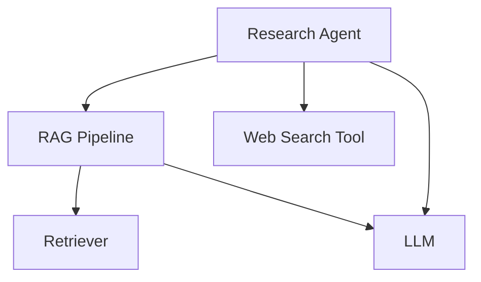

import { Callout } from "nextra/components";

# LLM Tracing (JS/TS)

Confident AI provides tracing capabilities for JavaScript and TypeScript applications using wrapper functions instead of decorators.

<Callout type="info">
  The core concepts of tracing are the same as in the Python SDK: spans, traces,
  attributes, etc. This page focuses on the JS/TS specific implementation. If
  you're new to tracing in Confident AI, please refer to the [Python tracing
  documentation](/llm-observability/llm-tracing) first.
</Callout>

## Setup and Initialization

Before using the tracing functionality in your TypeScript/JavaScript application, follow these steps:

### 1. Install the package

```bash
npm install @confident-ai/tracing
# or
yarn add @confident-ai/tracing
```

### 2. Set environment variables

The SDK requires your Confident AI API key to be set as an environment variable:

```bash
# In your .env file or environment
CONFIDENT_API_KEY=your-api-key
```

> **Note:** The SDK automatically detects and uses these environment variables without requiring explicit initialization code.

## Usage Example

Here's a concise example of tracing in a TypeScript application (same architecture as the Python example):



```tsx showLineNumbers copy {13, 22, 42, 58, 74}
import {
  wrapTool,
  wrapRetriever,
  wrapLLM,
  wrapCustom,
  wrapAgent,
  updateCurrentSpanAttributes,
  RetrieverAttributes,
  LlmAttributes,
} from "@confident-ai/tracing";

// Tool
const webSearch = wrapTool(
  async (query: string): Promise<string> => {
    // <--Include implementation to search web here-->
    return "Latest search results for: " + query;
  },
  { name: "web_search" }
);

// Retriever
const retrieveDocuments = wrapRetriever(
  async (query: string): Promise<string[]> => {
    // <--Include implementation to fetch from vector database here-->
    const fetchedDocuments = [
      "Document 1: This is relevant information about the query.",
      "Document 2: More relevant information here.",
      "Document 3: Additional context that might be useful.",
    ];

    updateCurrentSpanAttributes({
      embeddingInput: query,
      retrievalContext: fetchedDocuments,
    });

    return fetchedDocuments;
  },
  { embedder: "text-embedding-ada-002" }
);

// LLM
const generateResponse = wrapLLM(
  async (input: string): Promise<string> => {
    // <--Include format prompts and call your LLM provider here-->
    const output = "Generated response based on the prompt: " + input;

    updateCurrentSpanAttributes({
      input: input,
      output: output,
    });

    return output;
  },
  { model: "gpt-4" }
);

// Custom span wrapping the RAG pipeline
const ragPipeline = wrapCustom(
  async (query: string): Promise<string> => {
    // Retrieve
    const docs = await retrieveDocuments(query);
    const context = docs.join("\n");

    // Generate
    const response = await generateResponse(
      `Context: ${context}\nQuery: ${query}`
    );
    return response;
  },
  { type: "custom", name: "RAG Pipeline" }
);

// Agent that does RAG + tool calling
const researchAgent = wrapAgent(
  async (query: string): Promise<string> => {
    // Call RAG pipeline
    const initialResponse = await ragPipeline(query);

    // Use web search tool on the results
    const searchResults = await webSearch(initialResponse);

    // Generate final response incorporating both RAG and search results
    const finalResponse = await generateResponse(
      `Initial response: ${initialResponse}\n` +
        `Additional search results: ${searchResults}\n` +
        `Query: ${query}`
    );
    return finalResponse;
  },
  { name: "Research Agent", availableTools: ["web_search"] }
);

// Calling the agent will create traces on Confident AI
researchAgent("What is the weather like in San Francisco?");
```

## Key Differences from Python SDK

### Wrapper Functions vs Decorators

Instead of using `@observe` decorators as in Python, the JS/TS SDK provides wrapper functions. Here's a mapping between the Python decorators and their TypeScript/JavaScript wrapper equivalents. In the section below, we'll see how to use these wrappers in practice.

| Python Decorator             | TypeScript/JavaScript Wrapper |
| ---------------------------- | ----------------------------- |
| `@observe(type="llm")`       | `wrapLLM()`                   |
| `@observe(type="retriever")` | `wrapRetriever()`             |
| `@observe(type="tool")`      | `wrapTool()`                  |
| `@observe(type="agent")`     | `wrapAgent()`                 |
| `@observe(type="custom")`    | `wrapCustom()`                |

## Different Types of Spans

Confident AI provides five types of spans to accommodate various components of your LLM application. In the JavaScript/TypeScript SDK, all wrapper functions follow the same pattern:

```tsx
const tracedFunction = wrapXXX(
  originalFunction, // Your function to be traced
  {
    // Configuration object with parameters
    // Configuration parameters specific to the span type
  }
);
```

Unlike Python decorators which are placed above function definitions, JavaScript/TypeScript wrapper functions take your original function as the first argument, followed by a configuration object containing the span parameters.

### LLM Span

An LLM span represents a call to a language model. It tracks the input, output, and token usage of the model.

```tsx
const generateResponse = wrapLLM(
  async (prompt: string): Promise<string> => {
    // Your LLM logic here
    return "LLM response";
  },
  { model: "gpt-4" }
);
```

**Configuration Parameters:**

- `model` (required): A string representing the name of the LLM used
- `costPerInputToken` (optional): A number specifying the cost per input token
- `costPerOutputToken` (optional): A number specifying the cost per output token
- `name` (optional): A string specifying the display name
- `metrics` (optional): An array of strings specifying online metrics to run

### Retriever Span

A Retriever span represents a component that fetches information from a vector store or knowledge base.

```tsx
const retrieveDocuments = wrapRetriever(
  async (query: string): Promise<string[]> => {
    // Your retrieval logic here
    return ["document1", "document2"];
  },
  { embedder: "text-embedding-ada-002" }
);
```

**Configuration Parameters:**

- `embedder` (required): A string representing the name of the embedding model used
- `name` (optional): A string specifying the display name
- `metrics` (optional): An array of strings specifying online metrics to run

### Tool Span

A Tool span represents a function that an agent can call to perform specific tasks.

```tsx
const webSearch = wrapTool(
  async (query: string): Promise<string> => {
    // Your tool implementation
    return "Search results";
  },
  {
    name: "web_search",
    description: "Searches the web for information",
  }
);
```

**Configuration Parameters:**

- `name` (required): A string specifying the name of the tool
- `description` (optional): A string that describes what the tool does
- `metrics` (optional): An array of strings specifying online metrics to run

### Agent Span

An Agent span represents an autonomous entity that can make decisions and interact with other components.

```tsx
const researchAgent = wrapAgent(
  async (query: string): Promise<string> => {
    // Your agent implementation
    return "Agent response";
  },
  {
    name: "Research Agent",
    availableTools: ["web_search", "calculator"],
  }
);
```

**Configuration Parameters:**

- `name` (required): A string specifying the display name of the agent
- `availableTools` (optional): An array of strings representing available tools
- `agentHandoffs` (optional): An array of strings representing other agents this agent can delegate to
- `metrics` (optional): An array of strings specifying online metrics to run

### Custom Span

Custom spans are essential for creating hierarchical structures or grouping related spans together.

```tsx
const customProcess = wrapCustom(
  async (input: string): Promise<string> => {
    // Your custom implementation
    return "Result";
  },
  {
    type: "custom",
    name: "Custom Process",
  }
);
```

**Configuration Parameters:**

- `type` (required): The type of span, usually "custom" but can be any string
- `name` (required): A string specifying the display name
- `metrics` (optional): An array of strings specifying online metrics to run

## Set Runtime Attributes for Default Spans

Attributes can be set at runtime by using the `updateCurrentSpanAttributes()` function. This updates the attributes for the **CURRENT** span in the execution context.

```tsx
// Python equivalent: update_current_span_attributes(LlmAttributes(input=prompt, output=response))
updateCurrentSpanAttributes({
  input: prompt,
  output: response,
});
```

The current span is determined using JavaScript's async context, which automatically tracks the active span. This means you don't need to manually pass span references around - the system knows which span is currently executing.

### LLM Attributes

LLM attributes track the input, output, and token usage of language model calls:

```tsx
updateCurrentSpanAttributes({
  input: "What is the capital of France?",
  output: "The capital of France is Paris.",
  inputTokenCount: 7,
  outputTokenCount: 7,
});
```

There are **TWO** mandatory and **TWO** optional parameters for LLM attributes:

- `input`: The prompt or text (string) sent to the language model.
- `output`: The response generated (string) by the language model.
- [Optional] `inputTokenCount`: The number of tokens (number) in the input.
- [Optional] `outputTokenCount`: The number of tokens (number) in the generated response.

<Callout type="info">
  If `costPerInputToken` is not set in the wrapper configuration, setting the
  LLM attributes for `inputTokenCount` will not help calculate the cost. The
  same applies to output tokens.
</Callout>

### Retriever Attributes

Retriever attributes track the query, retrieved documents, and related metadata:

```tsx
updateCurrentSpanAttributes({
  embeddingInput: "Query to embed",
  retrievalContext: ["Document 1", "Document 2"],
  topK: 2,
  chunkSize: 1024,
});
```

There are **TWO** mandatory and **TWO** optional parameters for Retriever attributes:

- `embeddingInput`: The text (string) that needs to be embedded for vector search.
- `retrievalContext`: An array of strings representing the relevant documents or text chunks retrieved from your vector store.
- [Optional] `topK`: The number of top results (number) returned by the retriever.
- [Optional] `chunkSize`: The size of chunks (number) used for retrieval.

### Tool Attributes

Tool attributes track the input parameters and output of tool executions:

```tsx
updateCurrentSpanAttributes({
  inputParameters: { query: "Search query" },
  output: "Search results",
});
```

There are **TWO** optional parameters for Tool attributes:

- [Optional] `inputParameters`: An object containing the parameters passed to the tool function.
- [Optional] `output`: The result (any type) returned by the tool function.

<Callout type="info">
  If `updateCurrentSpanAttributes` is not called for a tool span, the system
  will automatically take the input and outputs of the function as the
  `inputParameters` and `output`.
</Callout>

### Agent Attributes

Agent attributes track the input and output of agent executions:

```tsx
updateCurrentSpanAttributes({
  input: "User query",
  output: "Agent response",
});
```

There are **TWO** optional parameters for Agent attributes:

- [Optional] `input`: The input to the agent (any type), typically the initial query or task description.
- [Optional] `output`: The agent's response or output (any type), including any actions taken or results produced.

<Callout type="info">
  Similar to the tool span, an agent span will take the wrapped function's input
  and output as the `input` and `output` of its attributes if not explicitly
  set.
</Callout>

## View Traces in Observatory

To view your traces, navigate to the **Observatory** page under your project space in Confident AI. Here you'll find detailed visualizations of your LLM application's execution flow, including span hierarchies, timing information, and error tracking. You can also open up your trace in full-screen for better visuals.

The trace visualization works exactly the same way regardless of whether you used the Python or TypeScript/JavaScript SDK to generate the traces. All span types (LLM, Retriever, Tool, Agent, Custom) are displayed with their hierarchical relationships, making it easy to analyze your application's performance and behavior.

For a more detailed walkthrough, please refer to the [video summary in the Python documentation](/llm-observability/llm-tracing#code--video-summary).
