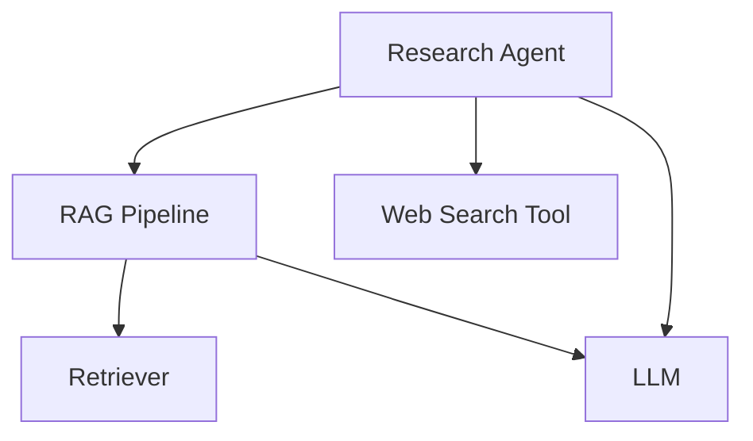

import { Callout } from "nextra/components";

# LLM Tracing

Tracing LLM workflows/systems on Confident AI allows you to pinpoint component level performances within your LLM app.

<Callout type="info">
  Tracing is a concept borrowed from traditional software engineering, where
  individual components of your LLM app (retrievers, tools, etc.) are modelled
  as **SPANS**, while the overall call hireachy and execution flow is displayed
  as a **TRACE**.

You can think of tracing as building a graph view of your LLM app.

</Callout>

Confident AI tracing is designed to be completely non-intrusive to your application. It:

- Requires no rewrite of your existing code - just add the `@observe` decorator
- Runs asynchronously in the background with zero impact on latency
- Fails silently if there are any issues, ensuring your app keeps running
- Works with any function signature - you can set input/output at runtime
- Allows you to [run online metrics](/llm-observability/online-metrics) for spans and traces in production.

For instance, even if your LLM function returns a complex object instead of a string, you can still use it with tracing. Just set the output attribute at runtime using `update_current_span_attributes()` - no need to modify your function's return type.

## Code & Video Summary

Consider this LLM app/agentic workflow:



```python showLineNumbers copy {11, 18, 36, 46, 58}
from typing import List
from deepeval.tracing import (
    observe,
    update_current_span_attributes,
    RetrieverAttributes,
    LlmAttributes,
)


# Tool
@observe(type="tool")
def web_search(query: str) -> str:
    # <--Include implementation to search web here-->
    return "Latest search results for: " + query


# Retriever
@observe(type="retriever", embedder="text-embedding-ada-002")
def retrieve_documents(query: str) -> List[str]:
    # <--Include implementation to fetch from vector database here-->
    fetched_documents = [
        "Document 1: This is relevant information about the query.",
        "Document 2: More relevant information here.",
        "Document 3: Additional context that might be useful.",
    ]

    update_current_span_attributes(
        RetrieverAttributes(
            embedding_input=query, retrieval_context=fetched_documents
        )
    )
    return fetched_documents


# LLM
@observe(type="llm", model="gpt-4")
def generate_response(input: str) -> str:
    # <--Include format prompts and call your LLM provider here-->
    output = "Generated response based on the prompt: " + input

    update_current_span_attributes(LlmAttributes(input=input, output=output))
    return output


# Custom span wrapping the RAG pipeline
@observe(type="custom", name="RAG Pipeline")
def rag_pipeline(query: str) -> str:
    # Retrieve
    docs = retrieve_documents(query)
    context = "\n".join(docs)

    # Generate
    response = generate_response(f"Context: {context}\nQuery: {query}")
    return response


# Agent that does RAG + tool calling
@observe(type="agent", available_tools=["web_search"])
def research_agent(query: str) -> str:
    # Call RAG pipeline
    initial_response = rag_pipeline(query)

    # Use web search tool on the results
    search_results = web_search(initial_response)

    # Generate final response incorporating both RAG and search results
    final_response = generate_response(
        f"Initial response: {initial_response}\n"
        f"Additional search results: {search_results}\n"
        f"Query: {query}"
    )
    return final_response


# Calling the agent will create traces on Confident AI
research_agent("What is the weather like in San Francisco?")
```

<VideoDisplayer
  src="https://confident-docs.s3.us-east-1.amazonaws.com/observability:llm-tracing.mp4"
  width="100%"
  title="LLM Tracing for an Agentic RAG App"
/>

## Terminologies for Tracing

Tracing in Confident AI consists of several key concepts:

- **Tracing**: The overall process of tracking and visualizing the execution flow of your LLM application
- **Spans**: Individual units of work within your application (e.g., LLM calls, tool executions, retrievals)
- **Attributes**: Properties that can be attached to spans to provide additional context and metadata
- **Default Span Types**: Pre-defined span types (Agent, Tool, Retriever, LLM) that come with specific attributes
- **Custom Spans**: User-defined spans for grouping or categorizing other spans

## Using the `@observe` Decorator

The `@observe` decorator is the primary way to instrument your LLM application for tracing. It's a simple Python decorator that can be imported from `deepeval.tracing`.

<Callout type="warning">
  Each decorated function **CREATES A SPAN**, and **MANY SPANS MAKE UP A
  TRACE**.
</Callout>

Here's how to use it:

```python
from deepeval.tracing import observe

@observe(type="llm", model="gpt-4")
def my_llm_function(prompt: str) -> str:
    # Your LLM logic here
    pass
```

## Different Types of Spans

Confident AI provides five types of spans to accommodate various components of your LLM application. These spans are designed to cover the most common use cases while allowing for customization when needed. For example, in an agentic RAG system, you might wrap a retriever and LLM span in a custom span named "RAG Pipeline" before executing tool calls.

### LLM span

An LLM span represents a call to a language model. It tracks the input, output, and token usage of the model.

```python showLineNumbers copy
from deepeval.tracing import observe

@observe(type="llm", model="gpt-4")
def generate_response(prompt: str) -> str:
    pass
```

There are **TWO** mandatory and **FOUR** optional parameters when decorating a function of the LLM span type:

- `type`: The type of span. Must be `"llm"` for LLM spans.
- `model`: A string representing the name of the LLM used.
- [Optional] `cost_per_input_token`: A float specifying the cost per input token. Defaulted to None.
- [Optional] `cost_per_output_token`: A float specifying the cost per output token. Defaulted to None.
- [Optional] `name`: A string specifying the display name on Confident AI. Defaulted to the name of the decorated function.
- [Optional] `metrics` A list of strings specifying the names of the online metrics you wish to run upon tracing to Confident AI. Learn more about using online metrics in the [next section here.](/llm-observability/online-metrics)

<Callout type="info">
  If `cost_per_input_token` is not set, setting the LLM attributes for
  `input_token_count` will not help calculate the cost. The same applies to
  output tokens.
</Callout>

### Retriever span

A Retriever span represents a component that fetches relevant information from a vector store or knowledge base. It's a crucial part of RAG (Retrieval-Augmented Generation) pipelines, handling the embedding and retrieval process.

```python showLineNumbers copy
from deepeval.tracing import observe

@observe(type="retriever", embedder="text-embedding-ada-002")
def retrieve_documents(query: str) -> List[str]:
    pass
```

There are **TWO** mandatory and **TWO** optional parameters when decorating a function of the retriever span type:

- `type`: The type of span. Must be `"retriever"` for retriever spans.
- `embedder`: A string representing the name of the embedding model used.
- [Optional] `name`: A string specifying the display name on Confident AI. Defaulted to the name of the decorated function.
- [Optional] `metrics` A list of strings specifying the names of the online metrics you wish to run upon tracing to Confident AI. Learn more about using online metrics in the [next section here.](/llm-observability/online-metrics)

### Tool span

A Tool span represents a function that an agent can call to perform a specific task. It's commonly used for function calling in LLM applications.

```python showLineNumbers copy
from deepeval.tracing import observe

@observe(type="tool")
def web_search(query: str) -> str:
    pass
```

There are **ONE** mandatory and **THREE** optional parameters when decorating a function of the tool span type:

- `type`: The type of span. Must be `"tool"` for tool spans.
- [Optional] `description`: A string that describes what the tool does. Defaulted to an empty string.
- [Optional] `name`: A string specifying the display name on Confident AI. Defaulted to the name of the decorated function.
- [Optional] `metrics` A list of strings specifying the names of the online metrics you wish to run upon tracing to Confident AI. Learn more about using online metrics in the [next section here.](/llm-observability/online-metrics)

### Agent span

An Agent span represents an autonomous entity that can make decisions and interact with other components. It's particularly useful for implementing thinking agents or multi-agent systems.

```python showLineNumbers copy
from deepeval.tracing import observe

@observe(
    type="agent",
    available_tools=["search", "calculator"],
    handoff_agents=["research_agent", "math_agent"],
)
def supervisor_agent(query: str) -> str:
    pass
```

There are **ONE** mandatory and **FOUR** optional parameters when decorating a function of the agent span type:

- `type`: The type of span. Must be `"agent"` for agent spans.
- [Optional] `available_tools`: A list of strings specifying the tools this agent can use. Defaulted to an empty list.
- [Optional] `handoff_agents`: A list of strings specifying other agents this agent can delegate to. Defaulted to an empty list.
- [Optional] `name`: A string specifying the display name on Confident AI. Defaulted to the name of the decorated function.
- [Optional] `metrics` A list of strings specifying the names of the online metrics you wish to run upon tracing to Confident AI. Learn more about using online metrics in the [next section here.](/llm-observability/online-metrics)

Agents can be nested within other agents, which is useful for implementing hierarchical agent architectures. For instance, a "supervisor" agent might coordinate communication between specialized agents.

### Custom span

Custom spans are essential for creating hierarchical structures or grouping related spans together. They provide flexibility in organizing your tracing data.

```python
@observe(
    type="custom",
    name="RAG Pipeline"
)
def rag_pipeline(query: str) -> str:
    pass
```

There is **ONE** mandatory and **TWO** optional parameters when decorating a function of the Custom span type:

- `type`: The type of span. Anything other than `"llm"`, `"retriever"`, `"tool"`, and `"agent"` is a custom span type.
- [Optional] `name`: A string specifying how this custom span is displayed on Confident AI. Defaulted to the name of the decorated function.
- [Optional] `metrics` A list of strings specifying the names of the online metrics you wish to run upon tracing to Confident AI. Learn more about using online metrics in the [next section here.](/llm-observability/online-metrics)

## Set Runtime Attributes for Default Spans

Attributes can only be set at runtime for default spans. To set runtime attributes, use the `update_current_span_attributes()` function. This function updates the attributes for the **CURRENT** span - which is the nearest `@observe` decorator level we are currently tracing. For example, if you have nested spans like:

```python showLineNumbers {8}
from deepeval.tracing import observe, update_current_span_attributes

@observe(type="custom", name="outer")
def outer_function():
    @observe(type="llm", name="inner")
    def inner_function():
        # Here, update_current_span_attributes() will update the LLM span
        update_current_span_attributes(...)
```

The current span is determined using Python's context variables, which automatically track the active span based on the execution context. This means you don't need to manually pass span references around - the system knows which span you're currently executing within.

<Callout>
  A useful thing about setting runtime attributes is it eliminates the need to
  rewrite your current codebase for the `@observe` decorator. For example, you
  can [set the
  `retrieval_context`](/llm-observability/llm-tracing#retriever-attributes) as
  the output of a retriever span, allowing you to maintain your existing
  function signatures without modification.
</Callout>

### LLM Attributes

LLM attributes track the `input`, `output`, and token usage of language model calls. It is highly **RECOMMENDED** that you set the attributes for an LLM span.

```python showLineNumbers copy
from deepeval.tracing import update_current_span_attributes, LlmAttributes

@observe(type="llm", model="gpt-4")
def generate_response(prompt: str) -> str:
    output = "Generated response"
    update_current_span_attributes(
        LlmAttributes(input=prompt, output=output)
    )
    return output
```

There are **TWO** mandatory and **TWO** optional parameters for `LLMAttributes`:

- `input`: The prompt or text of type `str` sent to the language model.
- `output`: The response generated of type `str` by the language model.
- [Optional] `input_token_count`: The number of tokens of type `int` in the input.
- [Optional] `output_token_count`: The number of tokens of type `int` in the generated response.

<Callout type="info">
  If `cost_per_input_token` is not set in the `@observe` decorator, setting the
  LLM attributes for `input_token_count` will not help calculate the cost. The
  same applies to output tokens.
</Callout>

### Retriever Attributes

Retriever attributes track the `embedding_input` and `retrieved_context` in RAG pipelines. It is highly **RECOMMENDED** that you set the attributes for a retriever span.

```python showLineNumbers copy
from deepeval.tracing import update_current_span_attributes, RetrieverAttributes

@observe(type="retriever", embedder="text-embedding-ada-002")
def retrieve_documents(query: str) -> List[str]:
    fetched_documents = ["doc1", "doc2"]
    update_current_span_attributes(
        RetrieverAttributes(embedding_input=query, retrieval_context=fetched_documents)
    )
    return fetched_documents
```

There are **TWO** mandatory parameters for `RetrieverAttributes`:

- `embedding_input`: The text of type `str` that needs to be embedded for vector search.
- `retrieval_context`: The list of type `str` that represents the relevant documents or text chunks retrieved from your vector store.

### Tool Attributes

Tool attributes track the input parameters and output of tool executions.

```python showLineNumbers copy
from deepeval.tracing import update_current_span_attributes, ToolAttributes

@observe(type="tool")
def web_search(query: str) -> str:
    result = "Search results"
    update_current_span_attributes(
        ToolAttributes(input_parameters={"query": query}, output=result)
    )
    return result
```

There are **TWO** optional parameters for `ToolAttributes`:

- [Optional] `input_parameters`: The parameters passed to the tool function of type `Dict`. Defaulted to the function `kwargs`.
- [Optional] `output`: The result returned by the tool function of type `Any`. Defaulted to the function output.

> [!TIP]
>
> If `update_current_span_attributes` is not called for a tool span, `deepeval` will automatically take the input and outputs of the function as the `input_parameters` and `output`.

### Agent Attributes

Agent attributes track the input and output of agent decisions and actions.

```python showLineNumbers copy
from deepeval.tracing import update_current_span_attributes, AgentAttributes

@observe(type="agent", available_tools=["web_search"])
def research_agent(query: str) -> str:
    response = "Agent response"
    update_current_span_attributes(
        AgentAttributes(input=query, output=response)
    )
    return response
```

There are **TWO** optional parameters for Agent attributes:

- `input`: The input to the agent of type `Any`, typically the initial query or task description. Defaulted to the function `kwargs`.
- `output`: The agent's response or output of type `Any`, including any actions taken or results produced. Defaulted to the function output.

<Callout type="info">
  Similar to the tool span, an agent span will take the `@observe` decorated
  functions's input and output as the `input` and `output` of its attributes.
</Callout>

## View Traces in Observatory

To view your traces, navigate to the **Observatory** page under your project space in Confident AI. Here you'll find detailed visualizations of your LLM application's execution flow, including span hierarchies, timing information, and error tracking. You can also open up your trace in full-screen for better visuals.

For a more detailed walkthrough, please refer to the [video summary above.](/llm-observability/llm-tracing#code--video-summary)

## Common questions

### What happens if sending to Confident AI errors?

If there's an error while sending trace data to Confident AI, your application will continue to run normally. The tracing system is designed to fail silently, ensuring that any issues with tracing don't impact your production application.

### What tracing integrations are available?

We currently support and are actively developing integrations with:

- LangChain
- OpenAI
- LlamaIndex
- LiteLLM

### Can I log prompts and different hyperparameters to spans?

Yes, this feature is scheduled for release in the last week of April 2025. You'll be able to attach prompts, model parameters, and other hyperparameters to your spans for better debugging and optimization.

### Can I log custom properties to spans?

Yes, this feature is scheduled for release in the first week of May 2025. You'll be able to add any custom properties to your spans to track additional metadata specific to your use case.

### Can I run online metrics on traces/spans?

Yes, you can learn how in the [next section.](/llm-observability/online-metrics)
