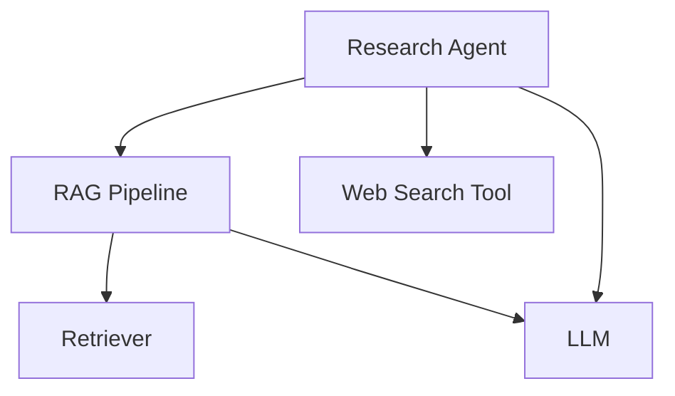

import { Callout } from "nextra/components";

# LLM Tracing

Tracing LLM workflows/systems on Confident AI allows you to pinpoint component level performances within your LLM app.

<Callout type="info">
  Tracing is a concept borrowed from traditional software engineering, where
  individual components of your LLM app (retrievers, tools, etc.) are modelled
  as **SPANS**, while the overall call hireachy and execution flow is displayed
  as a **TRACE**.

You can think of tracing as building a graph view of your LLM app.

</Callout>

Confident AI tracing is designed to be completely non-intrusive to your application. It:

- Requires no rewrite of your existing code - just add the `@observe` decorator
- Runs asynchronously in the background with zero impact on latency
- Fails silently if there are any issues, ensuring your app keeps running
- Works with any function signature - you can set input/output at runtime
- Allows you to [run online metrics](/llm-observability/online-metrics) for spans and traces in production.

For instance, even if your LLM function returns a complex object instead of a string, you can still use it with tracing. Just set the output attribute at runtime using `update_current_span()` - no need to modify your function's return type.

## Code & Video Summary

Consider this LLM app/agentic workflow:



```python showLineNumbers copy {11, 18, 36, 46, 58}
from typing import List
from deepeval.tracing import (
    observe,
    update_current_span,
    RetrieverAttributes,
    LlmAttributes,
)


# Tool
@observe(type="tool")
def web_search(query: str) -> str:
    # <--Include implementation to search web here-->
    return "Latest search results for: " + query


# Retriever
@observe(type="retriever", embedder="text-embedding-ada-002")
def retrieve_documents(query: str) -> List[str]:
    # <--Include implementation to fetch from vector database here-->
    fetched_documents = [
        "Document 1: This is relevant information about the query.",
        "Document 2: More relevant information here.",
        "Document 3: Additional context that might be useful.",
    ]

    update_current_span(
        attributes=RetrieverAttributes(
            embedding_input=query, retrieval_context=fetched_documents
        )
    )
    return fetched_documents


# LLM
@observe(type="llm", model="gpt-4")
def generate_response(input: str) -> str:
    # <--Include format prompts and call your LLM provider here-->
    output = "Generated response based on the prompt: " + input

    update_current_span(attribtues=LlmAttributes(input=input, output=output))
    return output


# Custom span wrapping the RAG pipeline
@observe(type="custom", name="RAG Pipeline")
def rag_pipeline(query: str) -> str:
    # Retrieve
    docs = retrieve_documents(query)
    context = "\n".join(docs)

    # Generate
    response = generate_response(f"Context: {context}\nQuery: {query}")
    return response


# Agent that does RAG + tool calling
@observe(type="agent", available_tools=["web_search"])
def research_agent(query: str) -> str:
    # Call RAG pipeline
    initial_response = rag_pipeline(query)

    # Use web search tool on the results
    search_results = web_search(initial_response)

    # Generate final response incorporating both RAG and search results
    final_response = generate_response(
        f"Initial response: {initial_response}\n"
        f"Additional search results: {search_results}\n"
        f"Query: {query}"
    )
    return final_response


# Calling the agent will create traces on Confident AI
research_agent("What is the weather like in San Francisco?")
```

<VideoDisplayer
  src="https://confident-docs.s3.us-east-1.amazonaws.com/observability:llm-tracing.mp4"
  width="100%"
  title="LLM Tracing for an Agentic RAG App"
/>

## Terminologies for Tracing

Tracing in Confident AI consists of several key concepts:

- **Tracing**: The overall process of tracking and visualizing the execution flow of your LLM application
- **Spans**: Individual units of work within your application (e.g., LLM calls, tool executions, retrievals)
- **Attributes**: Properties that can be attached to spans to provide additional context and metadata
- **Default Span Types**: Pre-defined span types (Agent, Tool, Retriever, LLM) that come with specific attributes
- **Custom Spans**: User-defined spans for grouping or categorizing other spans

## Using the `@observe` Decorator

The `@observe` decorator is the primary way to instrument your LLM application for tracing. It's a simple Python decorator that can be imported from `deepeval.tracing`.

<Callout type="warning">
  Each decorated function **CREATES A SPAN**, and **MANY SPANS MAKE UP A
  TRACE**.
</Callout>

Here's how to use it:

```python
from deepeval.tracing import observe

@observe(type="llm", model="gpt-4")
def llm_app(prompt: str) -> str:
    return openai.ChatCompletion.create(
        model="gpt-4o",
        messages=[
            {"role": "user", "content": query}
        ]
    ).choices[0].message["content"]
```

## Different Types of Spans

Confident AI provides five types of spans to accommodate various components of your LLM application:

- LLM
- Retriever
- Tool
- Agent
- Custom

These spans are designed to cover the most common use cases while allowing for customization when needed. For example, in an agentic RAG system, you might wrap a retriever and LLM span in a custom span named "RAG Pipeline" before executing tool calls.


## View Traces in Observatory

To view your traces, navigate to the **Observatory** page under your project space in Confident AI. Here you'll find detailed visualizations of your LLM application's execution flow, including span hierarchies, timing information, and error tracking. You can also open up your trace in full-screen for better visuals.

For a more detailed walkthrough, please refer to the [video summary above.](/llm-observability/llm-tracing#code--video-summary)

## Common questions

### What happens if sending to Confident AI errors?

If there's an error while sending trace data to Confident AI, your application will continue to run normally. The tracing system is designed to fail silently, ensuring that any issues with tracing don't impact your production application.

### What tracing integrations are available?

We currently support and are actively developing integrations with:

- LangChain
- OpenAI
- LlamaIndex
- LiteLLM

### Can I log custom metadata to traces and spans?

Yes, information [here.](/llm-observability/functionalities/metadata)

### Can I log prompts and different hyperparameters to spans?

Yes, this feature is scheduled for release in the last week of April 2025. You'll be able to attach prompts, model parameters, and other hyperparameters to your spans for better debugging and optimization.

### Can I run online metrics on traces/spans?

Yes, you can learn how in [here.](/llm-observability/functionalities/online-metrics)
