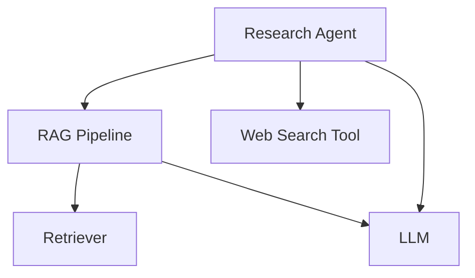

import { Callout } from "nextra/components";
import { Tabs } from "nextra/components";

# Online Metrics

You can define online metrics on a span level by providing the names of the metric enabled for monitoring on Confident AI in the `@obesrve` decorator

## Code & Video Summary

<Callout>
  There are no code summaries for languages other than Python. However you can
  find typescript examples in individual code snippets below.
</Callout>

Consider this exact same LLM app/agentic workflow from the [previous section](/llm-observability/llm-tracing):



```python showLineNumbers copy {5, 50, 61-63}
from typing import List
from deepeval.tracing import (
    observe,
    update_current_span_attributes,
    update_current_span_test_case_parameters,
    RetrieverAttributes,
    LlmAttributes,
)


# Tool
@observe(type="tool")
def web_search(query: str) -> str:
    # <--Include implementation to search web here-->
    return "Latest search results for: " + query


# Retriever
@observe(type="retriever", embedder="text-embedding-ada-002")
def retrieve_documents(query: str) -> List[str]:
    # <--Include implementation to fetch from vector database here-->
    fetched_documents = [
        "Document 1: This is relevant information about the query.",
        "Document 2: More relevant information here.",
        "Document 3: Additional context that might be useful.",
    ]

    update_current_span_attributes(
        RetrieverAttributes(
            embedding_input=query, retrieval_context=fetched_documents
        )
    )
    return fetched_documents


# LLM
@observe(type="llm", model="gpt-4")
def generate_response(input: str) -> str:
    # <--Include format prompts and call your LLM provider here-->
    output = "Generated response based on the prompt: " + input

    update_current_span_attributes(LlmAttributes(input=input, output=output))
    return output


# Custom span wrapping the RAG pipeline
@observe(
    type="custom",
    name="RAG Pipeline",
    metrics=["Answer Relevancy", "Faithfulness", "Contextual Relevancy"],
)
def rag_pipeline(query: str) -> str:
    # Retrieve
    docs = retrieve_documents(query)
    context = "\n".join(docs)

    # Generate
    response = generate_response(f"Context: {context}\nQuery: {query}")

    # Set test case to evaluate current span
    update_current_span_test_case_parameters(
        input=query, actual_output=response, retrieval_context=docs
    )
    return response


# Agent that does RAG + tool calling
@observe(type="agent", available_tools=["web_search"])
def research_agent(query: str) -> str:
    # Call RAG pipeline
    initial_response = rag_pipeline(query)

    # Use web search tool on the results
    search_results = web_search(initial_response)

    # Generate final response incorporating both RAG and search results
    final_response = generate_response(
        f"Initial response: {initial_response}\n"
        f"Additional search results: {search_results}\n"
        f"Query: {query}"
    )
    return final_response


# Calling the agent will trace & trigger
# online metrics on Confident AI
research_agent("What is the weather like in San Francisco?")
```

<VideoDisplayer
  src="https://confident-docs.s3.us-east-1.amazonaws.com/observability:online-metrics.mp4"
  width="100%"
  title="How to Enable Online Metrics for Tracing"
/>

## Recap on Referenceless Metrics

As we discussed in the [referenceless metrics](/concepts/metrics#referenceless-metrics) section, referenceless metrics are a special type of metric that can evaluate your LLM's performance without requiring reference data (like `expected_output` or `expected_tools`). This makes them particularly valuable for production monitoring where you typically don't have access to ground truth data.

In production, we call these referenceless metrics "online metrics" because they run in real-time as your application processes requests. The key advantages of using referenceless metrics in production are:

- **Real-time monitoring**: Evaluate your LLM's performance as it processes actual user requests
- **No reference data needed**: Works without requiring annotated datasets or ground truth data
- **Immediate feedback**: Get instant insights into your application's performance
- **Scalable evaluation**: Can handle high volumes of requests without manual annotation

In the following sections, you'll learn how to enable and configure these referenceless metrics for production monitoring.

## Enable Metric Collection for Monitoring

To enable referenceless metrics to run in production, you will need to [create a metric collection](/llm-evaluation/metrics#metrics-on-the-cloud), and press the **Enable for Monitoring** button for that metric collection.

This will make every **referenceless** metric, including custom metrics, you've enabled inside the metric collection runnable upon receiving the trace you've logged. For non-referenceless metrics, Confident AI will simply ignore them.

## Specify Metrics for Spans

Not all spans/components serve the same function, and so you don't want to be running the same metrics on each span. To specify which metrics inside your online metric collection should be ran, supply it as an argument in the `@observe` decorator:

<Tabs items={['Python', 'TypeScript']}>
  <Tabs.Tab>
```python showLineNumbers copy {6}
from deepeval.tracing import observe

@observe(
    type="custom",
    name="RAG Pipeline",
    metrics=["Answer Relevancy", "Faithfulness", "Contextual Relevancy"],
)
def rag_pipeline(query: str) -> str:
    pass
```
  </Tabs.Tab>
  <Tabs.Tab>
```typescript showLineNumbers copy {11}
import { observe } from '@confident/tracing';

const generate = async (prompt: string): Promise<string> => {
  // Your LLM logic here
  return "LLM response";
}
 
const observedGenerate = observe(
    type="llm",
    model: "gpt-4",
    metrics=["Answer Relevancy", "Faithfulness", "Contextual Relevancy"],
    fn: generate,
);
````

  </Tabs.Tab>
</Tabs>

The `metrics` argument is an optional list of strings that determines which metrics in your online metric collection will be ran for this current span.

<Callout>
  Supplying a metric name in `metrics` that doesn't exist or isn't activated on
  Confident AI will result in it failing silently. If metrics aren't showing up
  on the platform, make sure the names align perfectly. (PS. Watch out for
  trailing spaces!)
</Callout>

## Set Runtime Test Case Parameters for Spans

Once you've set your metrics, you'll need to define what the test case parameters are by using the `update_current_span_test_case_parameters()` function.

<Tabs items={['Python', 'TypeScript']}>
  <Tabs.Tab>
```python showLineNumbers copy {9-13}
from deepeval.tracing import observe, update_current_span_test_case_parameters

@observe(
    type="custom",
    name="RAG Pipeline",
    metrics=["Name of Metrics Enabled for Monitoring"],
)
def process_rag_pipeline(query: str) -> str:
    update_current_span_test_case_parameters(
        input="Replace with your input",
        actual_output="Repalce with the response to your input",
        retrieval_context=["Replace with text chunks from your vector db"]
    )
    return
```
  </Tabs.Tab>
    <Tabs.Tab>
```ts showLineNumbers copy {6-9}
import { observe, updateCurrentSpanTestCaseParameters } from '@confident/tracing';
 
const generate = async (prompt: string): Promise<string> => {
    fake_output = `Wow thanks for the ${prompt}`

    updateCurrentSpanTestCaseParameters(
        input=prompt,
        output=fake_output
    )
    return fake_output;
}
 
const observedGenerate = observe(
    type="llm",
    model: "gpt-4",
    metrics=["Answer Relevancy", "Faithfulness", "Contextual Relevancy"],
    fn: generate,
);
```
  </Tabs.Tab>
</Tabs>

These parameters maps 1-1 to those parameters in an `LLMTestCase`. You should [definitely read this](/concepts/test-cases#llmtestcase) if you're not sure what an `LLMTestCase` is.

<Callout type="info">
  Not setting the correct test case parameters isn't the end of the world. If
  you specify an enabled online metric in the `metrics` list but don't update
  your current span with the sufficient test case parameters for metric
  execution, it will simply show up as an error on Confident AI.
</Callout>

If you're also wondering, when you have nested spans (one function decorated with `@observe` calling another decorated function), the system always works with the most recently started span. Think of it like a stack of plates - you always work with the top plate.

```python showLineNumbers
from deepeval.tracing import observe, update_current_span_test_case_parameters

@observe(type="custom", name="outer")
def outer_function():
    @observe(type="llm", name="inner", metrics=["Your metric name"])
    def inner_function():
        # Here, update_current_span_test_case_parameters() will update the LLM span
        update_current_span_test_case_parameters(...)
```

In this example:

1. When `outer_function` starts, it creates the "outer" span
2. When `inner_function` is called, it creates the "inner" span on top
3. Any calls to `update_current_span_test_case_parameters()` during `inner_function`'s execution will update the "inner" span, not the "outer" one
4. This ensures that metrics and attributes are always applied to the correct, most specific span in your trace

Therefore, it is the `inner_function()` that will have the online metrics evaluated **NOT** the `outer_function()`.

<Callout>
  You'll notice this is extremely similar to the
  [`update_current_span_attributes()`](/llm-observability/llm-tracing#set-runtime-attributes-for-default-spans)
  function for setting span specific attributes, with the difference being the
  `update_current_span_test_case_parameters()` function can be called in custom
  spans as well.
</Callout>

## View Metrics in Observatory

This was actually already shown in the [previous section's video summary](/llm-observability/llm-tracing#code--video-summary), but here it is again:

<VideoDisplayer
  src="https://confident-docs.s3.us-east-1.amazonaws.com/observability:llm-tracing.mp4"
  width="100%"
  title="Online metrics for an Agentic RAG App"
/>
