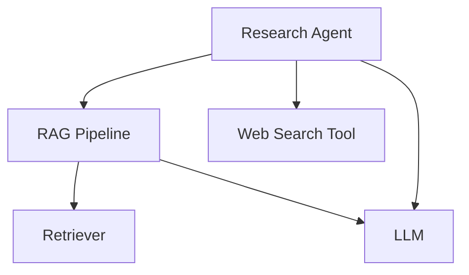

import { Callout } from "nextra/components";

# JS/Typescript 

Confident AI also offers **DeepEval.ts**, which suuports tracing in JS/Typescript in the form of wrapper functions to easily capture traces in JS/TS-native applications.

<Callout>
  You should first read [this original guide](/llm-tracing/introduction) on
  tracing in Python, before reading this page to get a full grasp on the concept
  of LLM tracing, what spans are, etc.
</Callout>

## Code & Video Demo

Consider this tracing example in a JS/TS application (same architecture as the [Python tracing example](/llm-tracing/introduction)):



```bash
npm install deepeval-ts
```
```ts showLineNumbers copy {11, 22, 44, 64, 82}
import {
  observe,
  updateCurrentSpanAttributes,
} from "deepeval-ts/tracing";


// Tool
const webSearch = observe({
  type: "tool",
  name: "web_search",
  fn: async (query: string) => {
    // <--Include implementation to search web here-->
    return "Latest search results for: " + query;
  },
});


// Retriever
const retrieveDocuments = observe({
  type: "retriever",
  embedder: "text-embedding-ada-002",
  fn: async (query: string) => {
    // <--Include implementation to fetch from vector database here-->
    const fetchedDocuments = [
      "Document 1: This is relevant information about the query.",
      "Document 2: More relevant information here.",
      "Document 3: Additional context that might be useful.",
    ];

    updateCurrentSpanAttributes({
      embeddingInput: query,
      retrievalContext: fetchedDocuments,
    });

    return fetchedDocuments;
  },
});


// LLM
const generateResponse = observe({
  type: "llm",
  model: "gpt-4",
  fn: async (input: string) => {
    // <--Include format prompts and call your LLM provider here-->
    const output = "Generated response based on the prompt: " + input;

    updateCurrentSpanAttributes({
      input: input,
      output: output,
      inputTokenCount: 10,
      outputTokenCount: 20,
    });

    return output;
  },
});


// Custom span wrapping the RAG pipeline
const ragPipeline = observe({
  type: "custom",
  name: "RAG Pipeline",
  fn: async (query: string) => {
    // Retrieve
    const docs = await retrieveDocuments(query);
    const context = docs.join("\n");

    // Generate
    const response = await generateResponse(
      `Context: ${context}\nQuery: ${query}`
    );
    return response;
  },
});


// Agent that does RAG + tool calling
const researchAgent = observe({
  type: "agent",
  name: "Research Agent",
  availableTools: ["web_search"],
  fn: async (query: string) => {
    const initialResponse = await ragPipeline(query);
    const searchResults = await webSearch(initialResponse);
    const finalResponse = await generateResponse(
      `Initial response: ${initialResponse}\n` +
        `Additional search results: ${searchResults}\n` +
        `Query: ${query}`
    );

    updateCurrentSpanAttributes({
      input: query,
      output: finalResponse,
    });
    return finalResponse;
  },
});


// Calling the agent will create traces on Confident AI
researchAgent("What is the weather like in San Francisco?");
```

<VideoDisplayer
  src="https://confident-docs.s3.us-east-1.amazonaws.com/observability:llm-tracing.mp4"
  width="100%"
  title="LLM Tracing for an Agentic RAG App"
/>

## Preparation

### Install DeepEval.ts

Before using the tracing functionality in your TypeScript/JavaScript application, follow these steps to install and initialize the DeepEval.ts:

```bash
npm install deepeval-ts
# or
yarn add deepeval-ts
```
<Callout type="warning">
If you get `TS2307: Cannot find module`, your TypeScript config likely doesn't support subpath imports.
Fix it by setting `"module": "Node16"` and `"moduleResolution": "node16"` in your `tsconfig.json`.
</Callout>

Then, set your Confident AI API key as an environment variable:

```bash
# In your .env file or environment
export CONFIDENT_API_KEY=your-api-key
```

DeepEval.ts automatically detects and uses these environment variables without
requiring explicit initialization code.

### DeepEval vs DeepEval.ts for tracing

<Callout type="info">
  From here onwards, we will refer to DeepEval’s python implementation simply as
  DeepEval, and the JavaScript/TypeScript implementation as DeepEval.ts.
</Callout>

Instead of DeepEval `@observe` decorators, the JS/TS SDK uses the `observe` wrapper. Below is a mapping of each Python decorator to its JavaScript/TypeScript wrapper equivalent:

| DeepEval `@obesrve` Decorator | DeepEval.ts `observe`       |
| ----------------------------- | --------------------------- |
| `@observe(type="llm")`        | `observe(type="llm")`  |
| `@observe(type="retriever")`  | `observe(type="retriever")`  |
| `@observe(type="tool")`       | `observe(type="tool")`  |
| `@observe(type="agent")`      | `observe(type="agent")`  |
| `@observe(type="custom")`     | `observe(type="custom")`  |

> [!NOTE]
>
> A more comprehensive explanation and the terminologies on tracing is available [here](/llm-tracing/introduction#terminologies-for-tracing), which is the python version of this page you're reading.

## Using `observe` Wrappers

The `observe` wrappers are the primary way to instrument your LLM application for tracing. They are a set of wrapper functions that provide domain-specific tracing for different types of spans.

<Callout type="warning">
  Each `observe` wrapper **CREATES A SPAN**, and **MANY SPANS MAKE UP A TRACE**.
</Callout>

Here's an example with the `observe` wrapper of `type` "llm", which creates an LLM span:

```ts
import { observe } from "deepeval-ts/tracing";

const observedGenerate = observe({
  type="llm"
  model: "gpt-4",
  fn: originalGenerateFunction, // Your function to be traced
});
```

Unlike Python decorators which are placed above function definitions, DeepEval.ts's observers take your span arguments then your original function as the following argument.

## Different Types of Spans

Confident AI offers five span types to instrument different parts of your LLM application. These built‑in spans cover common workflows yet remain fully customizable. For example, in an agentic RAG setup, you can nest retriever and LLM spans inside a custom “RAG Pipeline” span before invoking tool calls.

### LLM span

An LLM span represents a call to a language model. It tracks the input, output, and token usage of the model.

```ts showLineNumbers copy {9, 11}
import { observe } from "deepeval-ts/tracing";

const generate = async (prompt: string): Promise<string> => {
  // Your LLM logic here
  return "LLM response";
}

const observedGenerate = observe({
  type: "llm",
  model: "gpt-4",
  fn: generate,
});
```

There are **THREE** mandatory and **FOUR** optional parameters when configuring an LLM span:

- `type`: The type of span. Must be `"llm"` for LLM spans.
- `model`: A string representing the name of the LLM used.
- `fn`: The function you wish to trace as an LLM span.
- [Optional] `costPerInputToken`: A number specifying the cost per input token. Defaults to undefined.
- [Optional] `costPerOutputToken`: A number specifying the cost per output token. Defaults to undefined.
- [Optional] `name`: A string specifying the display name on Confident AI. Defaults to the name of the observed function.
- [Optional] `metrics`: An array of strings specifying the names of the online metrics you wish to run upon tracing to Confident AI. Learn more about using online metrics in the [next section here.](/llm-tracing/online-evaluations)

### Retriever span

A retriever span represents a component that fetches information from a vector store or knowledge base.

```ts showLineNumbers copy {9, 11}
import { observe } from "deepeval-ts/tracing";

const retrieve = async (query: string): Promise<string[]> => {
  // Your retrieval logic here
  return ["document1", "document2"];
};

const observedRetrieve = observe({
  type: "retriever",
  embedder: "text-embedding-ada-002",
  fn: retrieve
});
```

There is **THREE** mandatory and **TWO** optional parameters when configuring a retriever span:

- `type`: The type of span. Must be `"retriever"` for LLM spans.
- `embedder`: A string representing the name of the embedding model used.
- `fn`: The function you wish to trace as a retriever span.
- [Optional] `name`: A string specifying the display name on Confident AI. Defaults to the name of the observed function.
- [Optional] `metrics`: An array of strings specifying the names of the online metrics you wish to run upon tracing to Confident AI. Learn more about using online metrics in the [next section here.](/llm-tracing/online-evaluations)

### Tool span

A tool span represents a function that an agent can call to perform specific tasks.

```ts showLineNumbers copy {9, 11}
import { observe } from "deepeval-ts/tracing";

const webSearch = async (query: string): Promise<string> => {
    // Your tool implementation
    return "Search results";
}

const observedWebSearch = observe({
  type: "tool",
  description: "Search the web for information",
  fn: webSearch,
});
```

There is **TWO** mandatory and **THREE** optional parameters when configuring a tool span:

- `type`: The type of span. Must be `"tool"` for LLM spans.
- `fn`: The function you wish to trace as a tool span.
- [Optional] `name`: A string specifying the name of the tool to display on Confident AI. Defaults to the name of the observed function.
- [Optional] `description`: A string that describes what the tool does.
- [Optional] `metrics`: An array of strings specifying the names of the online metrics you wish to run upon tracing to Confident AI. Learn more about using online metrics in the [next section here.](/llm-tracing/online-evaluations)

### Agent span

An agent span represents an autonomous entity that can make decisions and interact with other components.

```ts showLineNumbers copy {9, 12}
import { observe } from "deepeval-ts/tracing";

const researchAgent = async (query: string): Promise<string> => {
  // Your agent implementation
  return "Agent response";
};

const observedResearchAgent = observe({
  type: "agent",
  name: "Research Agent",
  availableTools: ["web_search", "calculator"],
  fn: researchAgent
});
```

There is **TWO** mandatory and **FOUR** optional parameters when configuring an agent span:

- `type`: The type of span. Must be `"agent"` for LLM spans.
- `fn`: The function you wish to trace as an agent span.
- [Optional] `name`: A string specifying the name of the agent to display on Confident AI. Defaults to the name of the observed function.
- [Optional] `availableTools`: An array of strings representing available tools.
- [Optional] `agentHandoffs`: An array of strings representing other agents this agent can delegate to.
- [Optional] `metrics`: An array of strings specifying the names of the online metrics you wish to run upon tracing to Confident AI. Learn more about using online metrics in the [next section here.](/llm-tracing/online-evaluations)

Agents can be nested within other agents, which is useful for implementing hierarchical agent architectures. For instance, a "supervisor" agent might coordinate communication between specialized agents.

### Custom span

Custom spans are essential for creating hierarchical structures or grouping related spans together (for example, grouping a retriever and llm span together to form a "RAG" span).

```ts showLineNumbers copy {9, 11}
import { observe } from "deepeval-ts/tracing";

const custom = async (input: string): Promise<string> => {
  // Your custom implementation
  return "Result";
};

const observedCustom = observe({
  type: "custom",
  name: "Custom Process",
  fn: custom
});
```

There is **TWO** mandatory and **TWO** optional parameters when configuring a custom span:

- `type`: The type of span. Can be anything other than `"llm"`, `"retriever"`, `"tool"`, and `"agent"` for custom spans.
- `fn`: The function you wish to trace as a custom span.
- [Optional] `name`: A string specifying how this custom span is displayed on Confident AI. Defaults to the name of the wrapped function.
- [Optional] `metrics`: An array of strings specifying the names of the online metrics you wish to run upon tracing to Confident AI. Learn more about using online metrics in the [next section here.](/llm-tracing/online-evaluations)

## Set Runtime Attributes for Default Spans

Attributes can be set at runtime by using the `updateCurrentSpanAttributes()` function. This updates the attributes for the **CURRENT** span in the execution context.

```ts showLineNumbers
import { observe, updateCurrentSpanAttributes } from "deepeval-ts/tracing";

const generate = async (prompt: string)=> {
    ...

    // MUST be called within an observed function
    updateCurrentSpanAttributes({
      input: prompt,
      output: response,
      inputTokenCount: tokenCount(prompt),
      outputTokenCount: tokenCount(response)
    });

    return response;
}

const observedGenerate = observe({
  type: "llm",
  model: "gpt-4",
  fn: generate,
});
```

JavaScript’s async context automatically tracks the current span, so you don’t need to pass it around manually. This makes it easy to update tracing attributes — like `retrievalContext` — at runtime using `updateCurrentSpanAttributes()`, without changing your function’s return type.

### LLM attributes

LLM attributes track the input, output, and token usage of language model calls:

```ts showLineNumbers {6}
import { observe, updateCurrentSpanAttributes } from "deepeval-ts/tracing";

const generate = async (prompt: string): Promise<string> => {
  // Your LLM logic here

  updateCurrentSpanAttributes({
    input: prompt,
    output: response,
    inputTokenCount: 7,
    outputTokenCount: 7,
  });

  return "LLM response";
}

const observedGenerate = observe({
  type: "llm",
  model: "gpt-4",
  fn: generate,
});
```

There are **TWO** mandatory and **TWO** optional parameters for `LlmAttributes`:

- `input`: The prompt of type `Record<string, any>[]` **OR** `string` sent to the language model.
- `output`: The response generated of type `string` by the language model.
- [Optional] `inputTokenCount`: The number of tokens of type `number` in the input.
- [Optional] `outputTokenCount`: The number of tokens of type `number` in the generated response.

Note that for `input`, typically you would either send the list of messages as a list of `{"role": <role>, "content": <content>}` directly as you would to your LLM provider's APIs, or simply the user input as a pure `string` instead.

<Callout type="info">
  If `costPerInputToken` is not set in the wrapper configuration, setting the
  LLM attributes for `inputTokenCount` will not help calculate the cost. The
  same applies to output tokens.
</Callout>

### Retriever attributes

Retriever attributes track the query and retrieved context from vector stores or other retrieval systems:

```ts showLineNumbers {5}
import { observe, updateCurrentSpanAttributes } from "deepeval-ts/tracing";

const retrieve = async (query: string) => {
    ...
    updateCurrentSpanAttributes({
      embeddingInput: query,
      retrievalContext: documents,
    });

    return documents;
  }

const observedRetrieve = observe({
  type: "retriever",
  name: "Pinecone",
  fn: retrieve,
});
```

There are **TWO** mandatory parameters for `RetrieverAttributes`:

- `embeddingInput`: The text of type `string` that needs to be embedded for vector search.
- `retrievalContext`: The documents/chunks of type `string | string[]` retrieved from your vector store.

### Tool attributes

Tool attributes track the input parameters and output of tool executions:

```ts showLineNumbers {5}
import { observe, updateCurrentSpanAttributes } from "deepeval-ts/tracing";

const getWeather = async (location: string) => {
    ...
    updateCurrentSpanAttributes({
      inputParameters: location,
      output: weather,
    });

    return weather;
}

const observedGetWeather = observe({
  tool: "tool",
  name: "weather-api",
  fn: getWeather,
});
```

There are **TWO** optional parameters for `ToolAttributes`:

[Optional] `inputParameters`: The parameters passed to the tool function of type `Record<string, any>`. Defaulted to the function args.
[Optional] `output`: The result returned by the tool function of type `any`. Defaulted to the function output.

### Agent attributes

Agent attributes track the thought process and actions of an agent:

```ts showLineNumbers {5}
import { observe, updateCurrentSpanAttributes } from "deepeval-ts/tracing";

const researchAgent = async (request: string) => {
    ...
    updateCurrentSpanAttributes({
      input: request,
      output: finalResponse,
    });

    return finalResponse;
  }

const observedResearchAgent = observe({
  type: "agent",
  name: "travel-agent",
  fn: researchAgent,
});
```

There are **TWO** optional parameters for `AgentAttributes`:

- [Optional] `input`: The input to the agent of type `any`, typically the initial query or task description. Defaulted to the function args.
- [Optional] `output`: The agent’s response or output of type `any`, including any actions taken or results produced. Defaulted to the function output.

## View Traces in Observatory

To view your traces, navigate to the **Observatory** page under your project space in Confident AI. Here you'll find detailed visualizations of your LLM application's execution flow, including span hierarchies, timing information, and error tracking. You can also open up your trace in full-screen for better visuals.

For a more detailed walkthrough, please refer to the [video demo above](/llm-tracing/integrations/typescript#code--video-demo).
