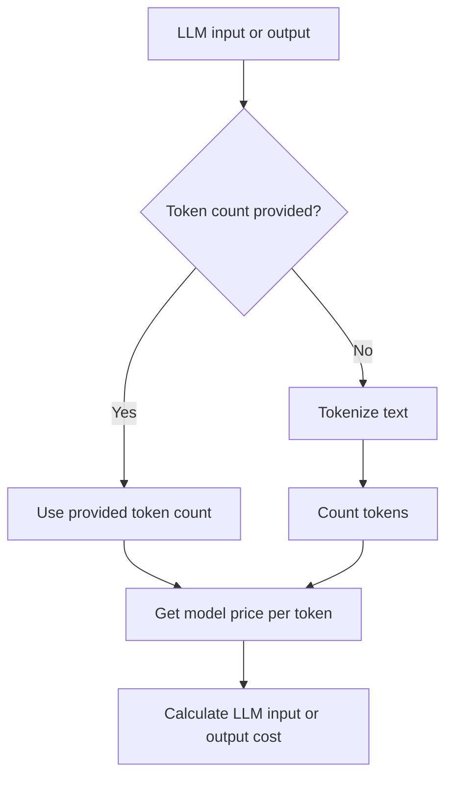

import { Callout } from "nextra/components";

# Latency and Cost Tracking

Confident AI lets you track the latency and cost of your LLM calls, which can help you identify inefficiencies in your LLM systems, such as high-cost models or heavy user usage.

<Callout type="info">
The `@observe` decorator automatically tracks a span's latency. Therefore, this guide will mainly focus on how to set up **cost tracking**.
</Callout>

## Quickstart

To set up cost tracking, provide the `cost_per_input_token` and `cost_per_output_token` in the `@observe` decorator of your LLM span, and pass the input and output token counts via `LlmAttributes`.

```python
from deepeval.tracing import update_current_span, LlmAttributes
 
@observe(type="llm", model="gpt-4o", cost_per_input_token=0.001, cost_per_output_token=0.001)
def generate_response(prompt: str) -> str:
    output = "Generated response"
    update_current_span(
        attributes=LlmAttributes(
            input=prompt,
            output=output,
            input_token_count=10,
            output_token_count=20,
        )
    )
    return output
```


The total cost of this call will be computed as:

```
(input_token_count × cost_per_input_token) + (output_token_count × cost_per_output_token)
```

> **Note:** Cost tracking is only available for spans of type `llm`.

## Automatic Cost Tracking

If the input and output token counts and per-token costs are not provided, Confident AI will automatically attempt to calculate them based on the `model` provided, although manual calculation is still recommended for accuracy.

<Callout>
Note that automatic cost tracking is only available for **OpenAI**, **Anthropic**, and **Gemini** models.
</Callout>

```python
from deepeval.tracing import update_current_span, LlmAttributes
 
@observe(type="llm", model="gpt-4o")
def generate_response(prompt: str) -> str:
    output = "Generated response"
    update_current_span(
        attributes=LlmAttributes(
            input=prompt,
            output=output,
        )
    )
    return output
```

For example, the code above will automatically calculate the cost of the LLM call based on the `model` provided. The calculation logic depends on whether the token counts are provided or not, as follows:



### Model tokenizers

Confident AI uses different tokenizers depending on the model provider.

|  Provider | Tokenizer | Example Models | Token Counting Method |
|-------------|-----------|----------------|----------------------|
| OpenAI | [tiktoken](https://github.com/openai/tiktoken) | GPT-4, GPT-3.5, O1, O3 | Client-side tokenization using model-specific encodings |
| Anthropic | [@anthropic-ai/tokenizer](https://www.npmjs.com/package/@anthropic-ai/tokenizer) | Claude 3 Opus, Claude 3 Sonnet, Claude 3 Haiku | Claude-specific tokenization algorithm |
| Google | Gemini API | Gemini 1.5 Pro, Gemini 2.0 Flash | Server-side token counting via API call |

See the [OpenAI documentation](https://platform.openai.com/docs/guides/text-generation/token-counting), [Anthropic documentation](https://docs.anthropic.com/claude/references/token-counting), or [Google documentation](https://ai.google.dev/pricing) for the most up-to-date pricing and token counting information.


## Analyzing Cost and Latency

Confident AI lets you perform comprehensive analyses of your LLM calls—breaking down costs by model, categorizing span latencies by span type, and more.

<VideoDisplayer
  src="https://confident-docs.s3.us-east-1.amazonaws.com/llm-tracing:cost-tracking.mp4"
  width="100%"
  title="LLM Cost and Latency Tracking"
/>
